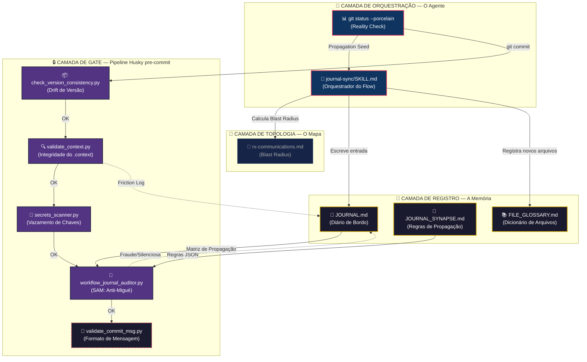
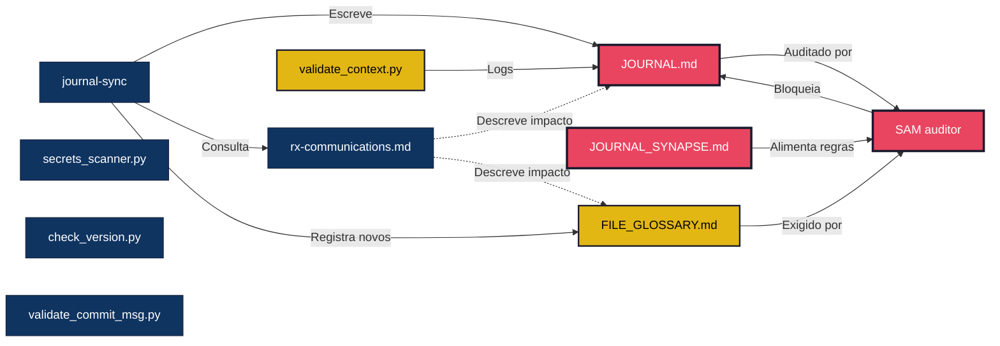

# 🔄 Flow Journal-Sync — O Pipeline de Governança

> Mapa visual e funcional de todos os elementos que compõem o processo de **sincronização, validação e commit** no framework H.O.K Forge.

---

## 🗺️ 1. Diagrama de Arquitetura (Visão Holística)

---

## 🧬 2. Perfil Individual dos Elementos

### 🧠 Camada de Orquestração

#### 1. `journal-sync/SKILL.md` — O Orquestrador
| Atributo | Detalhe |
|----------|---------|
| **Localização** | `.agent/skills/journal-sync/SKILL.md` |
| **Papel** | Skill determinística que orquestra todo o flow: Reality Check → SAM-Exempt Filter → Journal Sync → Blast Radius → Cascade → Integrity Guard → Report. |
| **Versão** | v2.1.0 (Closed-Loop + SAM-Exempt Filter) |
| **Lê de** | `git status`, `JOURNAL.md`, `rx-communications.md` |
| **Escreve em** | `JOURNAL.md`, arquivos no blast radius, `FILE_GLOSSARY.md` (se novos) |
| **Blast Radius** | 🟡 Alterar a skill muda o comportamento de sincronia, mas não altera as regras formais. |

#### 2. `git status --porcelain` — O Reality Check
| Atributo | Detalhe |
|----------|---------|
| **Papel** | Fonte única da verdade sobre o que mudou no repositório. Gera o "Propagation Seed". |
| **SAM-Exempt Filter** | Antes de processar, remove prefixos: `planos/`, `scratch/`, `temp/`, `.agents/` |
| **Short-Circuit** | Se output vazio → "No-Op" e para a execução. |

---

### 📝 Camada de Registro

#### 3. `JOURNAL.md` — O Diário de Bordo
| Atributo | Detalhe |
|----------|---------|
| **Localização** | `.context/maintenance/JOURNAL.md` |
| **Papel** | Memória contínua do projeto em Ordem Cronológica Reversa. Cada entrada contém: Estado Atual, Matriz de Propagação `[x]`, e Contrato SAM (plain text). |
| **Limite** | 600 linhas (acima → `purge_journal.py` arquiva 70% mais antigos) |
| **Regras de Escrita** | Cláusula de Castidade: chaves SAM (`executor_context_id`, `validator_context_id`, `status`) DEVEM ser plain text puro. Proibido Markdown nestas chaves. |
| **Blast Radius** | 🔴 **CRÍTICO** — É o "poço gravitacional". Todas as execuções convergem aqui. O SAM audita este arquivo contra o Git. |

#### 4. `JOURNAL_SYNAPSE.md` — O Motor de Regras
| Atributo | Detalhe |
|----------|---------|
| **Localização** | `.context/maintenance/JOURNAL_SYNAPSE.md` |
| **Papel** | Contém um bloco JSON machine-readable com regras de propagação obrigatória. Define: "se arquivo X mudou → exige tags Y no Journal e arquivos Z no diff". Opera em modo `strict` (bloqueia commit). |
| **Regras Atuais** | 6 regras ativas |
| **É consumido por** | `workflow_journal_auditor.py` (SAM) que parseia o JSON em runtime |
| **Blast Radius** | 🔴 Alterar regras aqui muda o que o SAM exige para aprovar commits. |

**Regras Registradas:**

| ID | Gatilho | Exige no Diff | Severidade |
|:---|:--------|:--------------|:-----------|
| `spec_driver_integrity` | `spec-driver.md` mudou | `REGISTRY`, `RULES`, `MASTER_FLOW` | 🔴 CRITICAL |
| `roles_registry_change` | `AGENT_REGISTRY.md` mudou | `FILE_GLOSSARY`, `SCRIPT_GLOSSARY` | 🔴 CRITICAL |
| `sql_change` | `schema.sql` mudou | `TECHNICAL_REQUIREMENTS` | 🔴 CRITICAL |
| `new_context_path` | Novo arquivo em `.context/` | `FILE_GLOSSARY` | 🔴 CRITICAL |
| `rules_change` | `RULES.md` mudou | Tags no Journal | 🟡 WARNING |
| `market_change` | `SSOT_MAP.md` mudou | Tags no Journal | 🟡 WARNING |

#### 5. `FILE_GLOSSARY.md` — O Dicionário
| Atributo | Detalhe |
|----------|---------|
| **Localização** | `.context/brain/FILE_GLOSSARY.md` |
| **Papel** | Registro de todos os arquivos `.md` do ecossistema com responsabilidade e agente guardião. Obrigatório registrar novos arquivos aqui (regra `new_context_path` do Synapse). |
| **É consumido por** | `validate_context.py`, `workflow_journal_auditor.py` |
| **Blast Radius** | 🟡 Se desatualizado, o SAM bloqueia commits com novos arquivos em `.context/`. |

---

### 📡 Camada de Topologia

#### 6. `rx-communications.md` — O Mapa de Blast Radius
| Atributo | Detalhe |
|----------|---------|
| **Localização** | `.context/maintenance/rx-communications.md` |
| **Papel no Flow** | O agente consulta as Seções 4-5 (Adjacency Lists) para calcular quais arquivos são afetados pela mudança. Define o blast radius da propagação em cascata. |
| **É consumido por** | `journal-sync` (Step 2), `@gov-friction-analyst`, qualquer agente avaliando impacto |
| **Blast Radius** | 🟢 Descritivo. Não executa, mas se desatualizado → propagação incompleta → SAM bloqueia. |

---

### 🔒 Camada de Gate (Husky pre-commit)

> O pipeline roda sequencialmente via `.husky/pre-commit`. Falha em qualquer gate = **commit bloqueado**.

#### 7. `check_version_consistency.py` — Gate 1: Versão
| Atributo | Detalhe |
|----------|---------|
| **Localização** | `.context/_scripts/check_version_consistency.py` |
| **Verifica** | Drift de versão entre `VERSION.md`, `package.json` e `INCEPTION.md` |
| **Bloqueio** | Exit 1 se as versões divergem |

#### 8. `validate_context.py` — Gate 2: Integridade
| Atributo | Detalhe |
|----------|---------|
| **Localização** | `.context/_scripts/validate_context.py` |
| **Verifica** | 11 checks: arquivos obrigatórios, Inception status, specs structure, sprint acceptance sync, journal lines (600 max), token estimate (400k chars), registry structure, metadata freshness, wiki integrity, atomic transition, journal chronology, state freshness |
| **Bloqueio** | Exit 1 se qualquer check FATAL falhar |
| **Logs** | Registra fricções no `HARNESS_LOG.md` via `log_friction()` |

#### 9. `secrets_scanner.py` — Gate 3: Segurança
| Atributo | Detalhe |
|----------|---------|
| **Localização** | `.context/_scripts/secrets_scanner.py` |
| **Verifica** | 5 padrões de segredos (API keys, Supabase, Stripe, etc.) em todos os arquivos tracked pelo Git |
| **Allowlist** | `.secrets-allowlist` + JSONs de config conhecidos |
| **Bloqueio** | Exit 1 se encontrar segredo real |

#### 10. `workflow_journal_auditor.py` (SAM) — Gate 4: Anti-Migué
| Atributo | Detalhe |
|----------|---------|
| **Localização** | `.context/_scripts/workflow_journal_auditor.py` |
| **Verifica** | 4 categorias de violação: regras do Synapse, segregação de contexto, **Fraude Narrativa** (alegar mudança que Git não viu), **Modificação Silenciosa** (mudar no Git sem registrar no Journal) |
| **SAM-Exempt** | `IGNORED_PREFIXES`: `planos/`, `scratch/`, `temp/`, `.agents/` |
| **Modo** | `strict` → Exit 1 bloqueia pipeline |
| **Blast Radius** | 🔴 O guardião final. Se ele rejeita, nada entra no Git. |

#### 11. `validate_commit_msg.py` — Gate 5: Mensagem
| Atributo | Detalhe |
|----------|---------|
| **Localização** | `.context/_scripts/validate_commit_msg.py` |
| **Verifica** | Formato da mensagem de commit (conventional commits) |
| **Acionamento** | Hook `.husky/commit-msg` (roda após pre-commit) |

---

## 🔄 3. Matriz de Propagação de Mudanças

### Tabela Resumo de Impacto

| Se alterar... | MUST sync (obrigatório) | SHOULD review (recomendado) |
|:---|:---|:---|
| `journal-sync/SKILL.md` | `JOURNAL.md` | `rx-communications.md` |
| `JOURNAL.md` | — (auto-mantido) | SAM (valida automaticamente) |
| `JOURNAL_SYNAPSE.md` | — | SAM, `JOURNAL.md` (novas regras mudam exigências) |
| `FILE_GLOSSARY.md` | — | SAM (regra `new_context_path`) |
| `rx-communications.md` | — | Todos (mapa de impacto) |
| `validate_context.py` | — | `HARNESS_LOG.md` |
| `workflow_journal_auditor.py` | `journal-sync/SKILL.md` (se mudar IGNORED_PREFIXES) | `JOURNAL_SYNAPSE.md` |
| `secrets_scanner.py` | — | `.secrets-allowlist` |

---

## ⛓️ 4. Sequência de Execução Completa

```mermaid
sequenceDiagram
    participant Agent as 🤖 Agente (journal-sync)
    participant Git as 📊 Git
    participant RX as 📡 rx-communications
    participant Journal as 📒 JOURNAL.md
    participant Husky as 🔒 Husky Pipeline
    participant SAM as 🤖 SAM Auditor

    Note over Agent: Step 0: Reality Check
    Agent->>Git: git status --porcelain
    Git-->>Agent: Propagation Seed
    Agent->>Agent: SAM-Exempt Filter<br/>(remove .agents/, planos/, etc)

    Note over Agent: Step 1: Journal Sync
    Agent->>Journal: Lê última entrada
    Agent->>Journal: Escreve nova entrada<br/>(Estado + Matriz [x] + Contrato SAM)

    Note over Agent: Step 2: Blast Radius
    Agent->>RX: Consulta Seções 4-5<br/>(Adjacency Lists)
    RX-->>Agent: Arquivos afetados

    Note over Agent: Step 3: Cascade Execution
    Agent->>Agent: Propaga mudanças em cascata<br/>(FILE_GLOSSARY, timestamps, etc)

    Note over Agent: Step 4: Integrity Guard
    Agent->>Git: git status --porcelain (2ª vez)
    Agent->>Agent: Compara Git vs Journal<br/>(todos [x] presentes?)
    Agent->>Agent: Governance Prediction<br/>(simula validate_context.py)

    Note over Agent: Step 5: Report
    Agent->>Agent: Gera walkthrough

    Note over Husky: git commit dispara pipeline
    rect rgb(83, 52, 131)
        Note over Husky: Pipeline Sequencial (Fail-Fast)
        Husky->>Husky: Gate 1: check_version_consistency.py
        Husky->>Husky: Gate 2: validate_context.py (11 checks)
        Husky->>Husky: Gate 3: secrets_scanner.py
        Husky->>SAM: Gate 4: workflow_journal_auditor.py
        SAM->>SAM: Parseia JOURNAL_SYNAPSE.md (JSON)
        SAM->>SAM: Fraude Narrativa check
        SAM->>SAM: Modificação Silenciosa check
        SAM->>SAM: Segregação de Contexto check
        SAM-->>Husky: PASS ou FATAL
    end

    rect rgb(27, 27, 47)
        Note over Husky: Hook commit-msg
        Husky->>Husky: Gate 5: validate_commit_msg.py
    end
```

---

## 🔑 5. Insights-Chave

> [!IMPORTANT]
> **O `JOURNAL_SYNAPSE.md` é o cérebro do SAM** — ele define em JSON machine-readable quais propagações são obrigatórias. Se você adiciona uma nova regra aqui (ex: "se mudar X, exija Y no diff"), o SAM automaticamente passa a bloquear commits que não cumpram. É o ponto mais alavancado do flow: uma linha de JSON muda o comportamento de todo o pipeline.

> [!NOTE]
> **O flow tem dois momentos distintos:** (1) o agente executando a skill journal-sync (cognitivo, guiado por instruções) e (2) o pipeline Husky (mecânico, scripts Python). O primeiro prepara; o segundo valida. Se o agente fizer tudo certo, o pipeline passa limpo. Se errar, o SAM bloqueia.

> [!TIP]
> **As zonas SAM-Exempt existem por design** — `planos/`, `scratch/`, `temp/`, `.agents/` são áreas de baixa governança onde iteração livre é permitida sem burocracia. Registrar arquivos dessas zonas no Journal causa "Fraude Narrativa" porque o SAM não os enxerga no `git["all"]`. A skill journal-sync filtra esses prefixos no Step 0.4.

> [!WARNING]
> **O `rx-communications.md` é o elo fraco** — se estiver desatualizado, o agente calcula o blast radius errado, propaga de forma incompleta, e o SAM bloqueia por "Modificação Silenciosa". Mantenha-o sincronizado com a realidade do repositório.

---

## 📊 6. Classificação por Camada

| Camada | Elemento | Natureza | Volatilidade |
|:---|:---|:---|:---|
| 🧠 Orquestração | `journal-sync/SKILL.md` | Cognitiva (Instrução) | Baixa (muda com hardening) |
| 🧠 Orquestração | `git status` | Mecânica (Comando) | N/A (efêmero) |
| 📝 Registro | `JOURNAL.md` | Acumulativa (Memória) | Alta (cresce a cada commit) |
| 📝 Registro | `JOURNAL_SYNAPSE.md` | Prescritiva (Regras JSON) | Baixa (muda com novas leis) |
| 📝 Registro | `FILE_GLOSSARY.md` | Prescritiva (Dicionário) | Média (novo arquivo = nova entrada) |
| 📡 Topologia | `rx-communications.md` | Descritiva (Mapa) | Média (sincroniza com realidade) |
| 🔒 Gate | `check_version_consistency.py` | Mecânica (Validação) | Baixa |
| 🔒 Gate | `validate_context.py` | Mecânica (11 checks) | Baixa |
| 🔒 Gate | `secrets_scanner.py` | Mecânica (Segurança) | Baixa |
| 🔒 Gate | `workflow_journal_auditor.py` | Mecânica (SAM) | Baixa |
| 🔒 Gate | `validate_commit_msg.py` | Mecânica (Formato) | Baixa |
