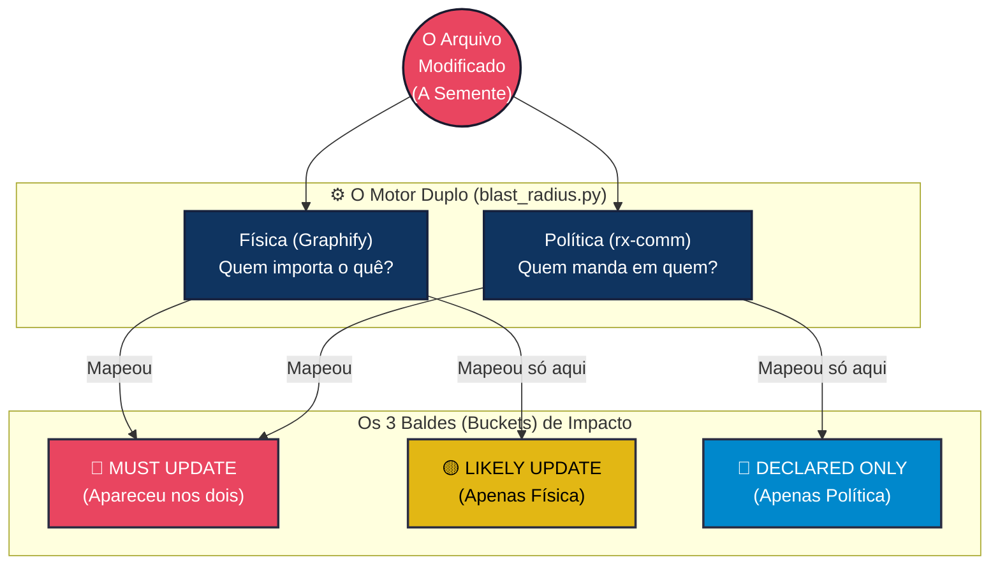
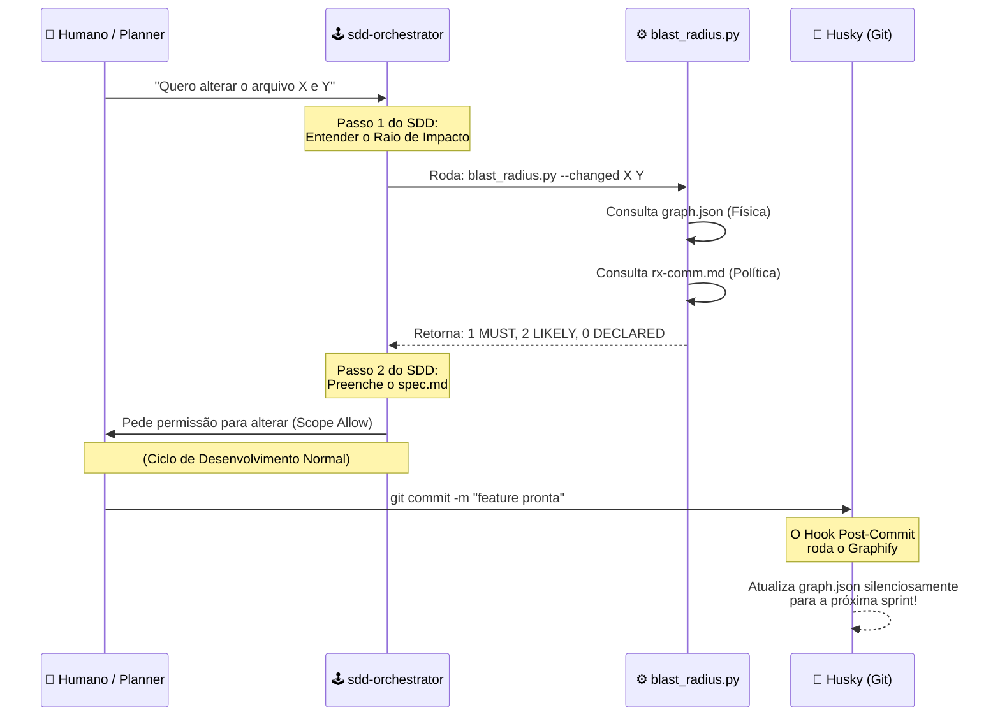

# 🌊 FLOW PROPAGATION: O Sistema de Blast Radius

> Mapa visual e didático do sistema de propagação de mudanças (Blast Radius) do H.O.K Forge (SSOT). Entenda como o sistema calcula as ondas de impacto quando você altera um arquivo.

---

## 🗺️ 1. Visão Holística (A Pedra no Lago)

Imagine que o nosso repositório é um lago calmo. Quando você edita um arquivo (seja código, seja regra), é como jogar uma pedra nesse lago. A pedra cai em um ponto central (a **Semente/Seed**), mas cria ondas que se espalham, balançando barcos que estão longe. 

O sistema de propagação existe para **mapear essas ondas antes de você jogar a pedra**, garantindo que nenhum barco afunde sem você saber.

---

## ⚙️ 2. O Motor Duplo (A Física vs A Política)

Para calcular até onde as ondas vão, o script principal (`blast_radius.py`) usa **dois sensores** completamente diferentes. Eles olham para o mesmo lago, mas procuram coisas diferentes.

### 🔬 O Sensor Estrutural (A Física)
- **Quem gera:** O *Graphify* (um arquivo chamado `graph.json`).
- **Como pensa:** Ele é um scanner de gravidade. Ele varre o código e vê: *"A função Login chama a função Senha. Logo, se Senha mudar, Login quebra."*
- **Sua limitação:** Ele é cego para regras e humanos. Ele não sabe que se você alterar um PDF de Negócios, um manual em `.md` precisa ser reescrito. Ele só lê código importando código.

### 📜 O Sensor de Governança (A Política)
- **Quem gera:** O `rx-communications.md`.
- **Como pensa:** Ele é a "Constituição". Ele mapeia coisas que o computador não vê, como: *"Se a Regra 1.5 mudar, o Comportamento do Agente de Testes deve mudar."*
- **Sua limitação:** Ele é mantido por humanos e IAs. Se alguém não o atualizou, a lei fica defasada.

**Por que usar os dois?** Porque o que a física não vê, a política cobra. E o que a política esquece, a física acusa (quebra).

---

## 🧮 3. A Matemática dos 3 Buckets

Quando o script processa os arquivos que você quer modificar, ele cruza as informações da Física com a Política e joga os arquivos afetados em 3 baldes (buckets) priorizados. 

Aqui está o que cada cor significa para você, traduzido de forma simples:

### 🔴 MUST UPDATE (Apareceu em Ambos)
- **O que significa:** O arquivo foi detectado pela "Física" (estão acoplados no código) E pela "Política" (alguém registrou que um afeta o outro).
- **Tradução Lúdica:** *A casa está pegando fogo e o alarme soou. Você precisa agir!*
- **O que fazer:** Edite e atualize esse arquivo, pois ele quase certamente quebrou ou perdeu sincronia.

### 🟡 LIKELY UPDATE (Só na Física)
- **O que significa:** O *Graphify* notou que eles estão ligados no código, mas o arquivo de governança não mapeou isso como algo crítico.
- **Tradução Lúdica:** *Tem fumaça, mas o alarme não tocou.* Pode ser um acoplamento bobo (ex: dois arquivos usam o mesmo botão), ou pode ser um "acoplamento fantasma" que ninguém notou.
- **O que fazer:** O Agente deve investigar visualmente. Se a mudança afetou a lógica dele, ele entra no pacote. Se não, ignore.

### 🔵 DECLARED ONLY (Só na Política)
- **O que significa:** O código em si não se toca, mas a regra burocrática diz que um afeta o outro (ex: atualizar a versão do app exige atualizar o Changelog).
- **Tradução Lúdica:** *O burocrata está te ligando para assinar o formulário.* 
- **O que fazer:** Se a mudança não exigir reescrever o texto, aplique o **Metadata-Only Propagation** (apenas atualize a data de "Última Atualização" do arquivo afetado para provar que você o visitou e validou).

---

## 📝 4. Tabela de Ação (Cheat Sheet)

Se você é um Subagente (ou um humano), aqui está a sua cartilha de reação quando o Blast Radius jogar arquivos nesses buckets:

| Cor / Balde | Nível de Perigo | O que eu faço com o arquivo afetado? |
| :--- | :--- | :--- |
| 🔴 **MUST UPDATE** | Crítico | Leia o arquivo, adapte a lógica/regras, e **adicione no commit**. |
| 🟡 **LIKELY UPDATE** | Moderado | Faça um `grep` ou leia o arquivo. Ele quebrou? Se sim, conserte. Se não, deixe-o em paz. |
| 🔵 **DECLARED ONLY** | Governança | Faça um "Carimbo Burocrático". Atualize o frontmatter (`Ultima Atualizacao`) do arquivo afetado para atestar que o protocolo foi cumprido, a menos que a mudança exija alterar o conteúdo lógico. |

---

## 🎬 5. O Fluxo de Execução (Nos Bastidores)

Como esse motor duplo é ativado na prática durante o seu dia a dia?

> [!TIP]
> **A Mágica do Husky:** O motor de física (`graph.json`) nunca fica velho! Toda vez que você faz um commit com sucesso, um gatilho escondido no Git (o `post-commit`) aciona o Graphify, atualizando o radar para que a próxima feature use mapas frescos e precisos.
