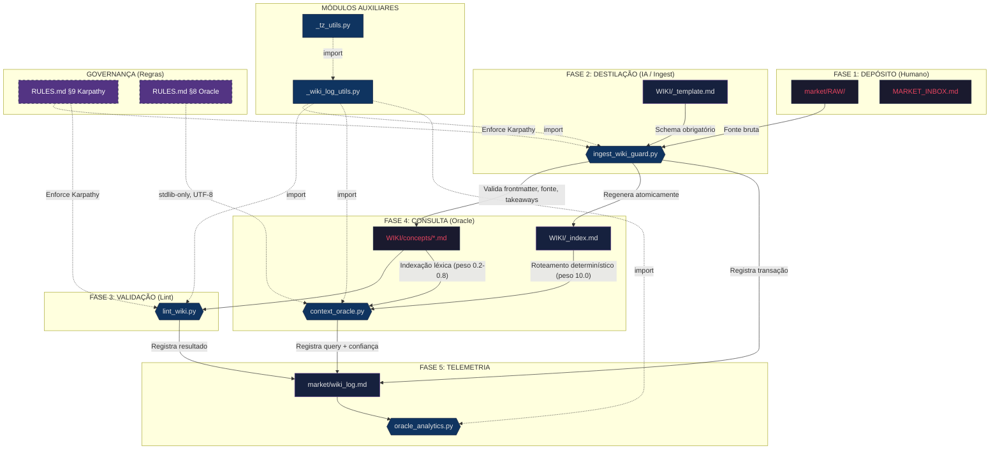

# 🔍 Flow Oracle & Wiki — Mapeamento Completo

> **Objetivo:** Documentar todos os arquivos, scripts e dados que participam do pipeline de conhecimento Wiki/Oracle do H.O.K Forge.

---

## 📊 Diagrama do Pipeline



---

## ✅ Checklist de Arquivos do Flow

### 📂 Dados e Armazenamento

| # | Arquivo | Tipo | Papel no Flow |
|---|---------|------|---------------|
| 1 | [market/RAW/](file:///c:/Users/User/Desktop/ProjetosAntigravity/TEMPLATES/template_inicío_de_projeto/.context/market/RAW) | Diretório | **Inbox de minério bruto.** Humano deposita PDFs, pesquisas e dossiês aqui. A IA operacional NÃO lê essa pasta diretamente. |
| 2 | [MARKET_INBOX.md](file:///c:/Users/User/Desktop/ProjetosAntigravity/TEMPLATES/template_inicío_de_projeto/.context/market/MARKET_INBOX.md) | Arquivo | **Caixa de entrada.** Links soltos e artigos antes de serem formalizados em RAW. |
| 3 | [WIKI/_template.md](file:///c:/Users/User/Desktop/ProjetosAntigravity/TEMPLATES/template_inicío_de_projeto/.context/market/WIKI/_template.md) | Template | **Molde obrigatório** para novos artigos. Define frontmatter (entity, concept, tags, aliases, source) e seções (Resumo, Regras, Exemplo, Links). |
| 4 | [WIKI/_index.md](file:///c:/Users/User/Desktop/ProjetosAntigravity/TEMPLATES/template_inicío_de_projeto/.context/market/WIKI/_index.md) | Índice | **Roteador determinístico.** Mapa `[[slug]] | tags: ...` usado pelo Oracle para priorizar matches (peso 10.0). Regenerado atomicamente pelo `ingest_wiki_guard.py`. |
| 5 | [WIKI/concepts/](file:///c:/Users/User/Desktop/ProjetosAntigravity/TEMPLATES/template_inicío_de_projeto/.context/market/WIKI/concepts) | Diretório | **Pílulas de conhecimento destilado.** Artigos atômicos (máx ~500 tokens) com frontmatter, fonte RAW e takeaways. Atualmente: `harness_architecture.md`, `harness_behavior.md`, `harness_maintainability.md`, `ralph_wiggum_loop.md`. |
| 6 | [wiki_log.md](file:///c:/Users/User/Desktop/ProjetosAntigravity/TEMPLATES/template_inicío_de_projeto/.context/market/wiki_log.md) | Log | **Rastro de auditoria (append-only).** Registra toda transação: INGEST, LINT, QUERY, SKIP com timestamp, status e arquivos afetados. |

### ⚙️ Scripts (Motores)

| # | Script | Comando NPM | Papel no Flow |
|---|--------|-------------|---------------|
| 7 | [context_oracle.py](file:///c:/Users/User/Desktop/ProjetosAntigravity/TEMPLATES/template_inicío_de_projeto/.context/_scripts/context_oracle.py) | `npm run context:oracle "pergunta"` | **O Oráculo.** Motor de busca RAG local (stdlib-only). Constrói índice em memória com 3 heurísticas de matching: corpo (0.2), filename (0.5), título (0.6-0.8). O `_index.md` dá peso 10.0 determinístico. Retorna top-3 com confiança. |
| 8 | [ingest_wiki_guard.py](file:///c:/Users/User/Desktop/ProjetosAntigravity/TEMPLATES/template_inicío_de_projeto/.context/_scripts/ingest_wiki_guard.py) | `npm run context:ingest-guard` | **Guardião de Ingestão.** Valida conformidade Karpathy em artigos: frontmatter, fonte RAW, Key Takeaways, conectividade. Regenera `_index.md` atomicamente (com retry para Windows). |
| 9 | [lint_wiki.py](file:///c:/Users/User/Desktop/ProjetosAntigravity/TEMPLATES/template_inicío_de_projeto/.context/_scripts/lint_wiki.py) | `npm run context:lint` | **Linter Epistemológico.** Varre `brain/`, `maintenance/` e `WIKI/` buscando claims sem citação. Modo `--strict` bloqueia o pipeline. Erros `[FATAL]` em WIKI sempre bloqueiam. |
| 10 | [oracle_analytics.py](file:///c:/Users/User/Desktop/ProjetosAntigravity/TEMPLATES/template_inicío_de_projeto/.context/_scripts/oracle_analytics.py) | `npm run context:oracle-analytics` | **Telemetria do Oráculo.** Parseia o `wiki_log.md` para calcular: total de consultas, confiança média, e gaps de conhecimento (queries com conf < 0.6 ou FAIL). |
| 11 | [_wiki_log_utils.py](file:///c:/Users/User/Desktop/ProjetosAntigravity/TEMPLATES/template_inicío_de_projeto/.context/_scripts/_wiki_log_utils.py) | *(import interno)* | **Helper de escrita.** Centraliza a gravação no `wiki_log.md` com spin-lock (concorrência segura) e escaping de pipes para Markdown. |
| 12 | [_tz_utils.py](file:///c:/Users/User/Desktop/ProjetosAntigravity/TEMPLATES/template_inicío_de_projeto/.context/_scripts/_tz_utils.py) | *(import interno)* | **Relógio.** Padroniza timestamps (fuso -3h Brasília). |

### 📜 Governança (Regras que restringem o Flow)

| # | Arquivo | Seção Relevante | O que governa |
|---|---------|-----------------|---------------|
| 13 | [RULES.md](file:///c:/Users/User/Desktop/ProjetosAntigravity/TEMPLATES/template_inicío_de_projeto/.context/brain/RULES.md) | §8 — Protocolo Oracle | **stdlib-only**, UTF-8 nativo, consultar se `confidence < 0.5`. |
| 14 | [RULES.md](file:///c:/Users/User/Desktop/ProjetosAntigravity/TEMPLATES/template_inicío_de_projeto/.context/brain/RULES.md) | §9 — Regra Karpathy | Estratificação de Densidade: RAW → WIKI (destilação). Frontmatter + fonte obrigatórios. INGEST → LINT → LOG. |

### 📡 Documentação de Topologia

| # | Arquivo | Papel |
|---|---------|-------|
| 15 | [rx-communications.md](file:///c:/Users/User/Desktop/ProjetosAntigravity/TEMPLATES/template_inicío_de_projeto/.context/maintenance/rx-communications.md) | Registra os acoplamentos destes scripts na Seção 5 ("Motores Epistemológicos"). |
| 16 | [SCRIPT_GLOSSARY.md](file:///c:/Users/User/Desktop/ProjetosAntigravity/TEMPLATES/template_inicío_de_projeto/.context/brain/SCRIPT_GLOSSARY.md) | Dicionário funcional de cada script com metáfora biológica e comando npm. |
| 17 | [FILE_GLOSSARY.md](file:///c:/Users/User/Desktop/ProjetosAntigravity/TEMPLATES/template_inicío_de_projeto/.context/brain/FILE_GLOSSARY.md) | Registra `wiki_log.md`, `WIKI/`, `SSOT_MAP.md` na seção `market/`. |
| 18 | [MASTER_FLOW.md](file:///c:/Users/User/Desktop/ProjetosAntigravity/TEMPLATES/template_inicío_de_projeto/.context/brain/MASTER_FLOW.md) | Ato 3 do Ciclo TLC: "Ingestão" via `ingest-guard` → artigo validado + `wiki_log.md`. |

---

## 🔄 Sequência de Execução (Workflow Real)

```
1. Humano deposita dossiê → market/RAW/nome.md
2. IA (ou humano) destila o dossiê → cria artigo em WIKI/concepts/ seguindo _template.md
3. npm run context:ingest-guard  → valida conformidade + regenera _index.md + loga em wiki_log.md
4. npm run context:lint          → valida citações e rastreabilidade + loga em wiki_log.md
5. npm run context:oracle "X"    → busca no _index.md + corpo dos artigos + loga query em wiki_log.md
6. npm run context:oracle-analytics → analisa wiki_log.md → emite relatório de gaps
```

---

## 🎯 Resumo: 18 peças no Flow Wiki/Oracle

| Categoria | Qtd | Itens |
|-----------|-----|-------|
| Dados/Armazenamento | 6 | RAW/, MARKET_INBOX.md, _template.md, _index.md, concepts/, wiki_log.md |
| Scripts executáveis | 4 | context_oracle.py, ingest_wiki_guard.py, lint_wiki.py, oracle_analytics.py |
| Módulos auxiliares | 2 | _wiki_log_utils.py, _tz_utils.py |
| Regras de governança | 2 | RULES.md §8, RULES.md §9 |
| Documentação de topologia | 4 | rx-communications.md, SCRIPT_GLOSSARY.md, FILE_GLOSSARY.md, MASTER_FLOW.md |
