# 🏗️ ARCHITECTURE: Integração Notion CRM e API Serverless

Este documento descreve a arquitetura de micro-integração serverless adotada para o fluxo de leads e CRM. A persistência de dados comerciais é descentralizada em nuvem utilizando o Notion de forma nativa e sem intermediários pagos (como Make ou Zapier).

---

## 🗺️ 1. Fluxo de Dados e Integração (Pipeline de Eventos)

```mermaid
sequenceDiagram
    participant Form as Typebot Chatbot (Client)
    participant API as Vercel Serverless Function (/api/webhook-intake)
    participant SDK as Notion Client SDK
    participant DB as Notion CRM Kanban Database (SSOT)

    Form->>API: HTTP POST /api/webhook-intake (Lead Payload + Bearer Secret)
    Note over API: Valida Token Bearer
    Note over API: Valida campos e formato de email
    Note over API: Higieniza celular para wa.me/{numero}
    
    rect rgb(20, 20, 30)
        Note over API: Mecanismo de Retry (Até 3 tentativas com backoff exponencial)
        API->>SDK: notion.pages.create()
        SDK->>DB: Criar lead card no Kanban (Triagem)
        DB-->>API: 201 Created (Database Response)
    end
    
    API-->>Form: HTTP 201 Success Response (Lead ID)
```

---

## 📦 2. Estrutura de Pastas e Componentes

| Camada / Componente | Arquivo / Diretório | Responsabilidade Principal | SSOT Vinculada |
| :--- | :--- | :--- | :--- |
| **Persistência Comercial (SSOT)** | Quadro Kanban do Notion | Base de dados exclusiva e Single Source of Truth comercial do CRM. | `.specs/features/api_notion_crm/spec.md` |
| **API Endpoints** | `api/webhook-intake.js` | Recebimento do webhook do Typebot, validação de segurança Bearer, sanitização do WhatsApp e retentativas. | `PRD.md` |
| **Automação de Schema** | `scripts/setup-crm.js` | Script CLI local para criar e estruturar as colunas do banco de dados Notion via SDK. | `spec.md` |
| **Testes Locais** | `tests/webhook-intake.test.js` | Suite de testes unitários locais com mocks do SDK do Notion. | `spec.md` |
| **Configurações** | `.env` / `.env.example` | Isolamento das chaves de ambiente e tokens de acesso à API. | `TECHNICAL_REQUIREMENTS.md` |

---

## 📐 3. Decisões Arquiteturais e Padrões Inegociáveis

1. **Notion como Banco SSOT:** Exclui-se o uso de bancos de dados relacionais (Postgres, MySQL) ou NoSQL (MongoDB) para evitar custos extras e duplicidade de dados comerciais.
2. **Resiliência via Exponential Backoff:** Devido ao rate limit e oscilações da API do Notion, a persistência de leads no webhook deve obrigatoriamente tentar o envio até 3 vezes em memória, com atrasos incrementais multiplicativos (`delay * 2^(tentativa - 1)`), antes de disparar erro 502 Bad Gateway.
3. **Validação Estrita de Inputs:** Toda requisição à API de webhook passa por validações de e-mail por regex, opções rígidas de orçamento (`budget`), autenticação de segredo estático e higienização regex de números de WhatsApp (extraindo apenas dígitos para garantir links clicáveis limpos).
