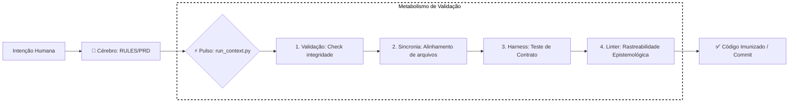

# 🧬 RX: Biologia Funcional do Framework (Modo Autobuilder)

Este documento descreve o **metabolismo** do Antigravity v2.5.2. Em vez de focar em pastas, aqui detalhamos como a informação "flui", como o sistema se auto-regula e como ele mantém a integridade da governança em tempo real.

---

## 🔄 O Metabolismo (Ciclo de Vida do Contexto)

O framework opera através de uma "esteira digestiva" que transforma intenções humanas em código validado.

---

## 🧠 Órgãos e Sínapses (Componentes Ativos)

Diferente da Anatomia (onde o arquivo mora), aqui descrevemos **o que ele faz quando o sistema "acorda"**.

### 1. O Sistema Nervoso Central (`run_context.py`)
*   **Função:** É o coração que bombeia os comandos para todos os outros órgãos.
*   **Sínapse:** Ativado via `npm run context:*`. Ele garante que nenhum script rode fora de ordem.

### 2. O Sistema Imunológico (`harness_runner.py`)
*   **Função:** Identifica "invasores" (decisões que violam o `INCEPTION.md` ou o `RULES.md`).
*   **Ação:** Ele "mata" o processo (Exit 1) se detectar que a IA está tentando burlar a segregação de papéis ou os limites estratégicos.

### 3. A Glândula de Crescimento (`sync_project.py` & `enrich_context.py`)
*   **Função:** Garante que, conforme o código cresce, a documentação (`TECHNICAL_REQUIREMENTS.md`) cresça junto de forma automática.
*   **Metabolismo:** Extrai informações do `package.json` e do código-fonte para manter a "Verdade Única" (SSOT).

### 4. O Sistema de Excreção (`purge_journal.py` & `cleanup_specs.py`)
*   **Função:** Evita a obesidade do contexto (Context Rot).
*   **Ação:** Remove specs antigas e arquiva entradas do Journal que não são mais úteis para a sessão atual, mantendo a IA ágil.

---

## 🛡️ Regras de Homeostase (Estabilidade)

Para que o framework não entre em colapso (alucinação), ele segue estas leis biológicas:

*   **Lei da Rastreabilidade (Karpathy Protocol):** Nenhum conhecimento novo entra na Wiki sem uma "Fonte" (DNA) citada no arquivo `raw/`.
*   **Lei do Isolamento:** O Agente Executor e o Agente Validador nunca podem compartilhar o mesmo "Sangue" (Context ID) em tarefas críticas.
*   **Lei do Ralph Wiggum:** Se a memória do chat (curto prazo) começar a poluir a lógica do projeto (longo prazo), o loop deve ser reiniciado (KBuM).

---

## 📈 Evolução (O Futuro RX do Produto)
Quando o **Autobuilder** terminar de consolidar o framework, esta "Biologia" passará a ser o sistema de suporte para a **Biologia do Produto** (regras de negócio, fluxos de usuário, etc.), que residirá em um novo artefato.

> [!IMPORTANT]
> **Diagnóstico Atual:** O framework está em fase de **Hipertrofia de Governança**. Estamos fortalecendo os scripts para que o futuro produto seja indestrutível.

---
**Especialistas Consultados:** `@arch-specialist`, `@gov-specialist`.
