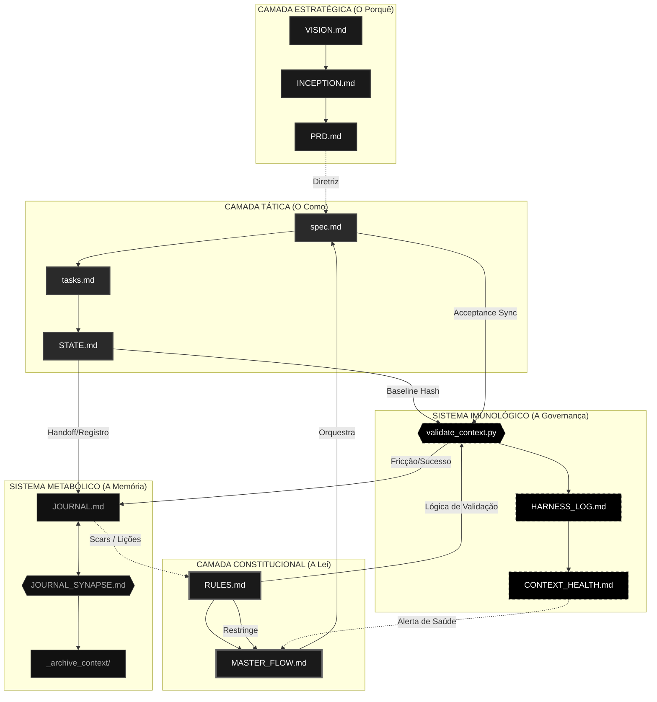

# 📡 RX-COMMUNICATIONS: Mapa de Conectividade Global (v2)

Este documento é o SSOT da topologia técnica do projeto. Ele descreve o "sistema nervoso" do ecossistema, mapeando como os artefatos de governança e execução se comunicam através de sinais, dependências e gatilhos.

---

## 🌌 1. Mapa Mestre de Conectividade (Visão Holística)

---

## 🔗 2. Tabela de Sinais de Conectividade

| Origem | Destino | Natureza do Sinal | Propósito |
| :--- | :--- | :--- | :--- |
| `PRD.md` | `spec.md` | **Diretriz** | Garante que o código atende ao requisito de negócio. |
| `RULES.md` | `validate_context.py` | **Protocolo** | Alimenta o "DNA" do que deve ser fiscalizado. |
| `MASTER_FLOW.md` | `spec.md` | **Orquestração** | Gatilho de nascimento de uma nova tarefa. |
| `STATE.md` | `validate_context.py` | **Evidência** | Foto física (hash) para garantir que não há drift. |
| `JOURNAL_SYNAPSE.md` | `JOURNAL.md` | **Metabólica** | Limpeza e compressão de memória para evitar bloat. |
| `JOURNAL.md` | `RULES.md` | **Aprendizado** | Cicatrizes (Scars) de erros passados viram novas leis. |

---

## 🛡️ 3. Governança da Conectividade
Qualquer alteração na responsabilidade de um arquivo (Glossário) ou na forma como eles se tocam deve ser refletida neste Mapa. Este documento é o guia definitivo para agentes de IA entenderem seu papel dentro do organismo H.O.K Forge.
