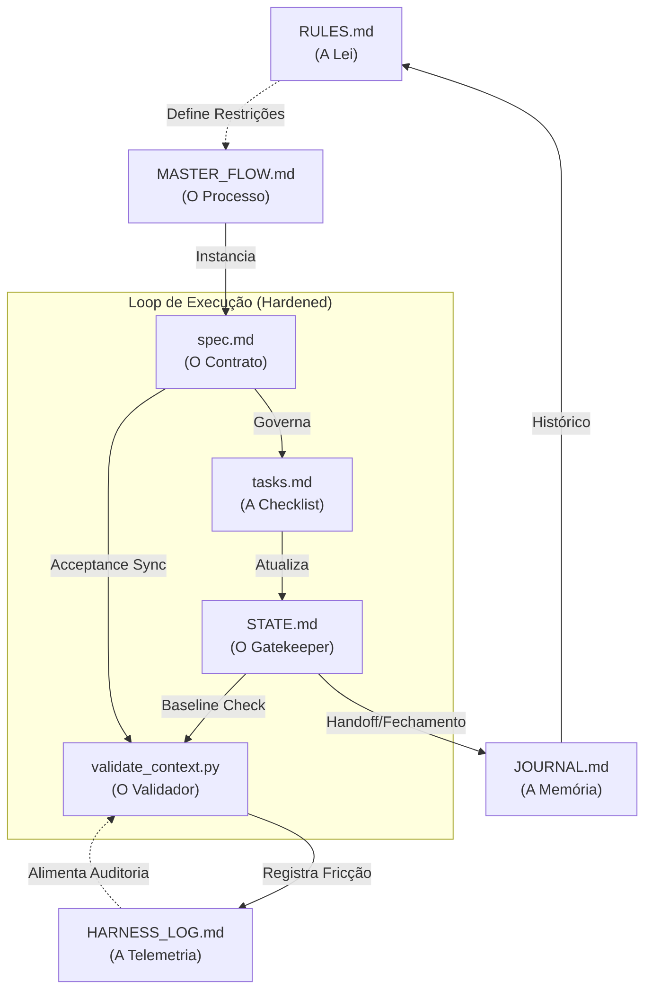

# 📡 RX-COMMUNICATIONS: Mapa de Conectividade do Ecossistema

Este documento é o SSOT de conectividade técnica. Ele mapeia como os artefatos de governança se "comunicam" entre si através de gatilhos, dependências e fluxos de validação.

---

## 🕸️ 1. Mapa de Conectividade (Nós e Arestas)

---

## 🔗 2. Tabela de Sinais (Interação de Artefatos)

| Nó Emissor | Nó Receptor | Sinal / Linha de Contato | Natureza |
| :--- | :--- | :--- | :--- |
| `spec.md` | `tasks.md` | Definição de Escopo | Diretiva |
| `tasks.md` | `STATE.md` | Progresso Atômico | Estado |
| `STATE.md` | `validate_context.py` | `start_hash` (Baseline) | Validação Crítica |
| `spec.md` | `validate_context.py` | `acceptance_sync` | Validação Crítica |
| `validate_context.py` | `HARNESS_LOG.md` | `[GOVERNANCE-FRICTION]` | Telemetria |
| `STATE.md` | `JOURNAL.md` | Handoff e Signoff | Memória |

---

## 🛡️ 3. Bloqueios Fail-Closed (Circuit Breakers)

As linhas de contato acima não são apenas informativas; elas possuem travas mecânicas:

1.  **GF-ATOMIC-DESYNC**: Se a linha `STATE.md` ⮕ `Git History` falhar (hash inexistente), o pipeline morre.
2.  **GF-ACCEPTANCE-DESYNC**: Se a linha `tasks.md` ⮕ `spec.md` estiver em descompasso (tarefas [x] vs acceptance [ ]), o commit é bloqueado.
3.  **GF-NARRATIVE-FRAUD**: Se a linha `JOURNAL.md` ⮕ `Git Diff` alegar uma modificação não detectada fisicamente, o processo é abortado.

---

## 📈 4. Telemetria de Conectividade
O monitoramento da saúde destas conexões é feito através do `[GOVERNANCE-FRICTION]`, registrando a "resistência" (atrito) que o sistema encontra ao tentar manter a coerência entre os nós.
