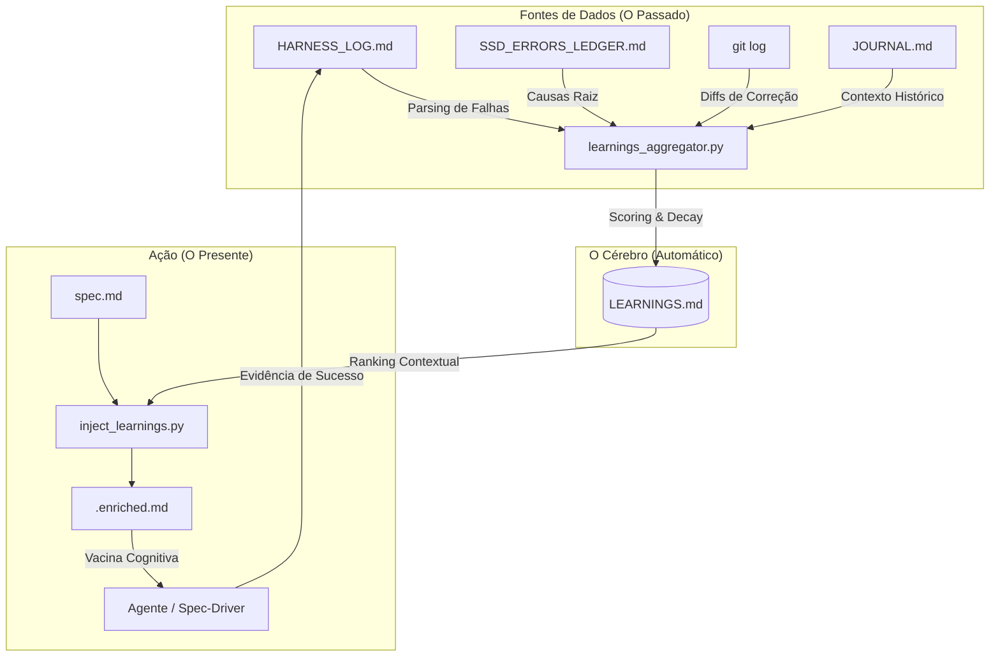

# 🧠 RX: H.O.K Learnings (Governança Cognitiva)

## 1. O Que é o Learnings Framework?
No ecossistema H.O.K Forge, o **Learnings Framework** é o sistema de memória estratégica. Enquanto outros sistemas (como o SAM ou o Harness) focam em validar o *presente*, o Learnings foca em aprender com o *passado* para proteger o *futuro*.

Ele resolve o problema do "Agente Amnésico": IAs tendem a cometer os mesmos erros repetidamente se não forem lembradas explicitamente de falhas anteriores. O sistema automatiza esse lembrete (via motor MiMo), transformando erros em "cicatrizes" (Scars) que servem de vacina para as próximas execuções.

---

## 2. Arquitetura Visual (O Fluxo da Memória)

---

## 3. Os Componentes Vitais

### ⚙️ 1. O Agregador (`learnings_aggregator.py`)
É o minerador de dados. Ele varre os logs do sistema em busca de padrões de erro. 
- **Auto-Detecção:** Se o Harness falhar 3 vezes no mesmo ponto, o agregador cria um alerta de "Loop Detectado".
- **Scoring Dinâmico:** Ele atribui uma pontuação para cada erro baseada na gravidade e na frequência.
- **Decaimento Temporal:** Erros antigos perdem força (score diminui) para que o agente foque nos problemas mais recentes e relevantes.

### 📚 2. A Memória Central (`LEARNINGS.md`)
O repositório SSOT (Single Source of Truth) de todo o conhecimento estratégico. Ele armazena as **Scars** (Cicatrizes), que contêm:
- O que falhou.
- Por que falhou (Causa Raiz).
- Como foi corrigido (Prevention Snippet).
- O nível de "febre" (Score).

### 💉 3. O Injetor (`inject_learnings.py`)
O componente que realiza a **Injeção de Contexto**. Antes de uma tarefa começar, ele lê a especificação do trabalho (`spec.md`) e busca na memória as 3 a 5 cicatrizes mais parecidas com o que o agente está prestes a fazer.

### 🧪 4. A Spec Enriquecida (`.enriched.md`)
É o arquivo final que o agente lê. Ele contém a Spec original, mas com um "Aditivo de Memória" no topo. Isso garante que o agente receba a vacina sem precisar procurar por ela.

---

## 4. Mecânicas Avançadas de Governança

| Mecânica | Função | Impacto |
| :--- | :--- | :--- |
| **Ranking Contextual** | Compara palavras-chave da tarefa atual com a memória. | Garante que o agente não receba "ruído", apenas o que importa agora. |
| **Fail-Closed Memory** | Se o sistema de memória falhar, o gate do Harness emite um alerta. | Impede que o projeto siga em frente "fingindo" que não tem histórico. |
| **Institucionalização** | Registro formal em Glossários e Rules. | Torna o comportamento do sistema previsível para humanos e outras IAs. |

---

## 5. Por que isso é Revolucionário?
A maioria das IAs opera em um "eterno agora". O MiMo Learnings introduz o concept de **Governança Cognitiva**. 

Ao invés de apenas dar ordens (Rules), nós damos **experiência**. O sistema diz ao agente: *"Da última vez que alguém tentou fazer o que você vai fazer agora, o sistema quebrou por causa DISSO. Aqui está como evitar que aconteça de novo."*

Isso reduz drasticamente o retrabalho, economiza tokens (evitando loops de erro) e aumenta a maturidade técnica do repositório a cada commit realizado.

---
> **RX v2.1** — Gerado em 2026-05-04  
> **Status:** Operacional | **Fases:** 5/5 Concluídas
