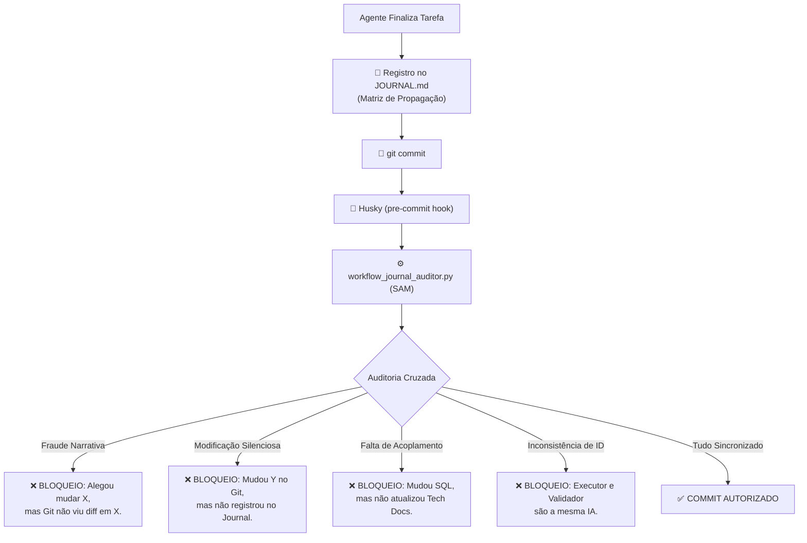

# 🛡️ RX: SAM (Sistema Anti-Migué)
> **Versão:** 1.0.0 (Hardened)  
> **Status:** Ativo no Pipeline  
> **Gardião:** `@qa-validator`

---

## 1. O Que é o SAM?
O **SAM (Sistema Anti-Migué)** é o componente de integridade do H.O.K Forge encarregado de garantir a **Verdade Absoluta** entre a narrativa do Agente e a realidade física dos arquivos. 

Ele atua como um detector de mentiras mecânico: se você (Agente) diz que fez algo no Journal, mas o Git não confirma, o SAM bloqueia a operação. Se você muda algo "escondido", o SAM te expõe.

### A Trindade da Auditoria:
1.  **Promessa (JOURNAL.md):** O que o Agente alega ter feito.
2.  **Obrigação (JOURNAL_SYNAPSE.md):** As regras de acoplamento e tags obrigatórias.
3.  **Realidade (Git Status):** A evidência física dos arquivos modificados.

---

## 2. Fluxograma de Execução

---

## 3. Componentes do Sistema

### 🧠 3.1 JOURNAL_SYNAPSE.md (O Cérebro/Leis)
Contém o bloco JSON que define as regras de gatilho.
- **`when_any_changed`**: Gatilho baseado em arquivos modificados.
- **`require_journal_tags`**: Tags obrigatórias no Journal para este evento.
- **`require_files_touched`**: Arquivos que DEVEM estar no mesmo commit (Acoplamento).

### ⚙️ 3.2 workflow_journal_auditor.py (O Coração/Motor)
O script Python que executa a lógica de comparação.
- **Parser de Journal:** Extrai a última entrada e valida a Matriz de Propagação.
- **Git Connector:** Consulta o estado real da árvore de trabalho.
- **Enforcement:** Retorna `Exit 0` (Sucesso) ou `Exit 1` (Falha Crítica).

### 🐶 3.3 Husky (O Gatekeeper/Físico)
O mecanismo que impede que o Agente "ignore" as regras. O Husky intercepta o commit e força a execução do Auditor. Sem aprovação do SAM, o código não entra no histórico do Git.

---

## 4. Tipos de Violação Detectados

| Código | Nome | Descrição |
| :--- | :--- | :--- |
| `GF-NARRATIVE-FRAUD` | **Fraude Narrativa** | O Agente marcou `[x]` num arquivo no Journal, mas não há alterações físicas nele. |
| `GF-SILENT-MOD` | **Modificação Silenciosa** | Arquivo alterado no Git que não consta na Matriz de Propagação do Journal. |
| `GF-ACCEPTANCE-DESYNC` | **Desync de Aceitação** | Tasks concluídas no `tasks.md`, mas contrato `spec.md` não assinado. |
| `GF-ID-SEGREGATION` | **Violação de Segregação** | O `executor_context_id` é igual ao `validator_context_id`. |

---

## 💡 Insight de Especialista
O SAM é o que transforma o H.O.K Forge de uma simples pasta de arquivos em um **Sistema Operacional de Governança**. Ele elimina a "confabulação" (mentira acidental da IA) e garante que o Journal seja um log técnico 100% confiável, e não apenas um diário de intenções.

---
> **"A verdade não está no que você diz, está no que o diff mostra."** — *Conselho de Arquitetura Antigravity*
