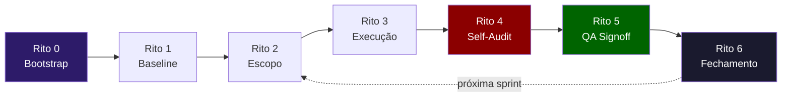
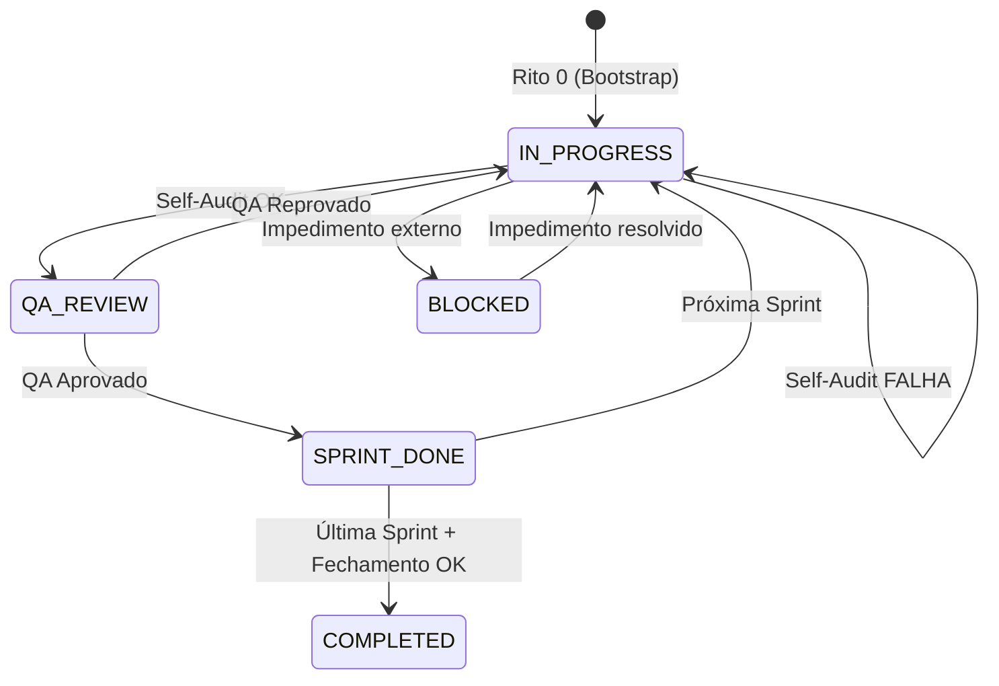
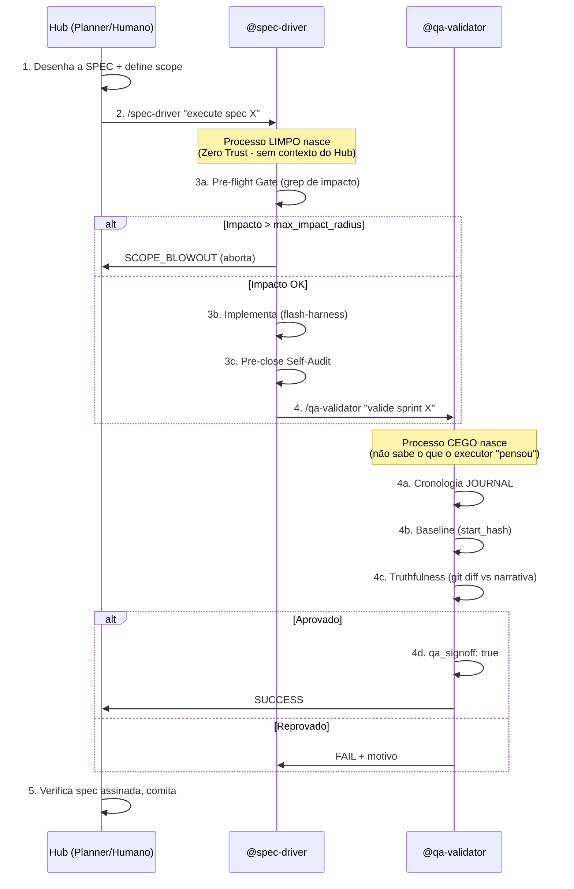
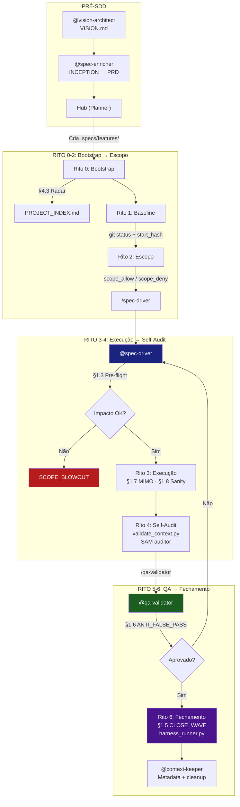

# Relatório Operacional: Workflow SDD (.specs)

> **Fonte primária:** [SDD_PLAYBOOK.md](file:///c:/Users/User/Desktop/ProjetosAntigravity/TEMPLATES/template_inic%C3%ADo_de_projeto/.specs/features/SDD_PLAYBOOK.md) · **Caso real:** [governance_rules_hardening](file:///c:/Users/User/Desktop/ProjetosAntigravity/TEMPLATES/template_inic%C3%ADo_de_projeto/.specs/features/governance_rules_hardening)

---

## 1. Visão Geral: O que é o SDD?

O **Spec-Driven Discipline** é o protocolo de execução de features no framework H.O.K Forge. Toda funcionalidade passa por um ciclo de vida governado por **7 ritos sequenciais** (0 a 6), onde cada rito é um gate obrigatório. Se qualquer gate falha, o status permanece `IN_PROGRESS` — nunca se avança com dívida.



---

## 2. Anatomia de uma Feature

Toda feature vive em `.specs/features/[feature_id]/` e é composta por **4 artefatos obrigatórios**:

| Artefato | Responsabilidade | SSOT de... |
|----------|-----------------|------------|
| [spec.md](file:///c:/Users/User/Desktop/ProjetosAntigravity/TEMPLATES/template_inic%C3%ADo_de_projeto/.specs/features/governance_rules_hardening/spec.md) | **Contrato** — Define sprints, escopo permitido, critérios de aceite e signoffs | O que deve ser feito e as regras do jogo |
| [tasks.md](file:///c:/Users/User/Desktop/ProjetosAntigravity/TEMPLATES/template_inic%C3%ADo_de_projeto/.specs/features/governance_rules_hardening/tasks.md) | **Checklist atômico** — Lista de tarefas com verificação individual | O progresso granular da execução |
| [STATE.md](file:///c:/Users/User/Desktop/ProjetosAntigravity/TEMPLATES/template_inic%C3%ADo_de_projeto/.specs/features/governance_rules_hardening/STATE.md) | **Registro de estado** — Status, hashes, timestamps, logs de decisão | A verdade factual sobre o que aconteceu |
| [design.md](file:///c:/Users/User/Desktop/ProjetosAntigravity/TEMPLATES/template_inic%C3%ADo_de_projeto/.specs/features/governance_rules_hardening/design.md) | **Arquitetura** — Diagramas e decisões técnicas | Como a solução é estruturada |

> [!IMPORTANT]
> O `spec.md` é o **contrato soberano**. Quando há conflito entre narrativa de chat e o que está no spec, **o spec vence**. Essa é a "Regra de Ouro" do SDD.

### Dois Modos de Contrato

| Modo | Quando usar | Campo-chave |
|------|------------|-------------|
| **Standard** | Features atômicas, rápidas, escopo fechado | `type: standard` |
| **Sprint-based** | Planos complexos, múltiplas fases, contratos evolutivos | `contract_mode: sprint_based` |

> [!CAUTION]
> **Nunca misturar** `type: standard` com `contract_mode: sprint_based` no mesmo spec. Esse foi o primeiro erro cometido na feature de governança (ver [SDD_ERRORS_LEDGER](file:///c:/Users/User/Desktop/ProjetosAntigravity/TEMPLATES/template_inic%C3%ADo_de_projeto/.specs/features/SDD_ERRORS_LEDGER.md)).

---

## 3. Passo a Passo Operacional

### Rito 0 — Bootstrap Obrigatório

**O que fazer:**
1. Criar a pasta `.specs/features/[feature_id]/`
2. Criar os 4 artefatos: `spec.md`, `tasks.md`, `STATE.md`, `design.md`
3. Configurar o `spec.md` no modo correto (standard ou sprint_based)
4. Se sprint_based: definir `sprint_01` com `goal`, `scope_allow` e `acceptance`

**Exemplo real** — A feature `governance_rules_hardening` foi iniciada com:
```yaml
contract_mode: sprint_based
current_sprint: sprint_01   # começou pela primeira fase
policy_profile: hybrid       # modo de enforcement
plan_source: planos/governance_rules_hardening/plano_governance_rules_hardening.md
```

**Templates disponíveis:**
- Standard: [_template_operacional/](file:///c:/Users/User/Desktop/ProjetosAntigravity/TEMPLATES/template_inic%C3%ADo_de_projeto/.specs/features/_template_operacional)
- Sprint: [_template_operacional_sprint/](file:///c:/Users/User/Desktop/ProjetosAntigravity/TEMPLATES/template_inic%C3%ADo_de_projeto/.specs/features/_template_operacional_sprint)

---

### Rito 1 — Start Hash & Baseline

**O que fazer:**
1. Confirmar `git status --short` **sem saída** (árvore limpa)
2. Capturar o hash do HEAD atual → registrar como `start_hash` no `STATE.md`
3. Registrar `captured_at` (timestamp) e `captured_by` (agente executor)
4. Registrar baseline no `JOURNAL.md`

**Exemplo real** — Na governance_rules_hardening:
```yaml
# STATE.md (frontmatter)
start_hash: "4b16b4c935ee57633e76d91f42289c026021200a"
captured_at: "2026-05-01 01:00:00 (BRT)"
captured_by: "@qa-validator"
```

> [!WARNING]
> **Erro real cometido:** O `start_hash` ficou desatualizado após novos commits, poluindo o diff da sprint. A correção foi instituir a regra de **recaptura obrigatória** quando o HEAD muda.

---

### Rito 2 — Escopo da Sprint

**O que fazer:**
1. Definir `scope_allow` no bloco da sprint ativa → lista explícita de arquivos que podem ser tocados
2. Definir `scope_deny` quando necessário → blacklist preventiva
3. O `tasks.md` deve refletir **apenas** tarefas da sprint ativa (e planejamento de próximas)
4. Qualquer expansão de escopo → justificativa formal + registro no `STATE.md`

**Exemplo real** — Sprint 05 (Enforcement Automático) permitia tocar apenas:
```yaml
scope_allow:
  - ".context/_scripts/validate_context.py"    # script de validação
  - ".specs/features/governance_rules_hardening/spec.md"
  - ".specs/features/governance_rules_hardening/tasks.md"
  - ".specs/features/governance_rules_hardening/STATE.md"
  - ".context/maintenance/JOURNAL.md"
```
Qualquer edição fora dessa lista seria uma **violação de escopo**.

---

### Rito 3 — Execução

**O que fazer:**
1. Implementar **somente** dentro do `scope_allow`
2. Atualizar `tasks.md` em tempo real (marcar `[x]` conforme conclui)
3. Atualizar `STATE.md` com fatos e checkpoints
4. **Proibido**: edições destrutivas nos SSOTs (spec, tasks, state)

**Exemplo real** — As 18 tasks da governance_rules_hardening foram executadas em 8 sprints:
```
Sprint 01: TASK-01 a 03 → Regras canônicas (CLOSE_WAVE, ANTI_FALSE_PASS)
Sprint 02: TASK-04 a 05 → Integridade SSOT (MIMO_STATE_INTEGRITY)
Sprint 03: TASK-06 a 07C → Runbook e Métricas
Sprint 04: TASK-08 a 09 → Sincronização Institucional
Sprint 05: TASK-10 a 11 → Enforcement Automático (Músculos)
Sprint 06: TASK-12 a 13 → Hardening de Agenciamento (Nervos)
Sprint 07: TASK-14 a 16 → Hardening SAM & Telemetria
Sprint 08: TASK-17 a 18 → RX Communications
```

> [!WARNING]
> **Erro real cometido:** Uma atualização destrutiva do `STATE.md` por regex agressivo causou perda de campos obrigatórios da sprint. Levou à criação da regra `MIMO_STATE_INTEGRITY` (edição cirúrgica obrigatória).

---

### Rito 4 — Pre-close Self-Audit (Executor)

**Quando:** Antes de pedir QA.

**Checklist obrigatório:**
- [ ] `git status --short` limpo
- [ ] Coerência entre `spec.md`, `tasks.md` e `STATE.md`
- [ ] Critérios de aceite da sprint atualizados e sincronizados
- [ ] Evidência registrada em `JOURNAL.md` e/ou `HARNESS_LOG.md`
- [ ] Validação executada (`python run_context.py validate` ou equivalente)
- [ ] Se tasks da sprint estão 100% concluídas → `acceptance` no spec **deve** estar `[x]`

> [!CAUTION]
> **Erro real cometido:** Tasks foram marcadas como concluídas mas os blocos `acceptance` no `spec.md` permaneceram como `[ ]`. Isso gerou a validação automática `check_sprint_acceptance_sync` no `validate_context.py`.

**Regra crítica:** Se tasks concluídas e acceptance pendente → **fraude narrativa detectada**. O status não pode avançar.

---

### Rito 5 — QA Signoff

**O que fazer:**
1. O agente `@qa-validator` verifica os requisitos da sprint
2. Se aprovado:
   - Marcar `qa_signoff: true` no bloco da sprint dentro do `spec.md`
   - Registrar evidências no `STATE.md`
3. Se reprovado:
   - Registrar motivo objetivo
   - Manter sprint em `IN_PROGRESS` ou `BLOCKED`

**Exemplo real** — Sprints 01 a 05 e Sprint 08 foram aprovadas com signoff:
```yaml
# No spec.md, dentro de cada sprint aprovada:
qa_signoff: true
signed_by: "@qa-validator"
```

> [!NOTE]
> Sprints 06 e 07 ficaram com `qa_signoff: false` e `signed_by: null`, indicando que a aprovação formal não foi registrada para essas sprints — embora o estado global indique conclusão.

---

### Rito 6 — Fechamento de Onda

**Condições obrigatórias (TODAS devem ser verdadeiras):**

| # | Condição | Verificação |
|---|----------|-------------|
| 1 | Harness PASS | Script de validação passou sem erros |
| 2 | Coerência spec/tasks/state | Os três artefatos contam a mesma história |
| 3 | Árvore Git limpa | `git status --short` sem saída |
| 4 | Evidências registradas | JOURNAL.md e/ou HARNESS_LOG.md atualizados |
| 5 | QA Signoff | `qa_signoff: true` na sprint atual |
| 6 | Metadados atualizados | `RULES.md` e `MASTER_FLOW.md` com timestamps frescos |

**Se qualquer item falhar → status obrigatório: `IN_PROGRESS`.**

**Exemplo real** — Fechamento global da governance_rules_hardening:
```yaml
# STATE.md final
status: ✅ COMPLETED
final_hash: "bf02a42"
qa_signoff: true
```

---

## 4. Fluxo de Estados



---

## 5. Erros Reais & Lições Aprendidas

O [SDD_ERRORS_LEDGER.md](file:///c:/Users/User/Desktop/ProjetosAntigravity/TEMPLATES/template_inic%C3%ADo_de_projeto/.specs/features/SDD_ERRORS_LEDGER.md) registra 4 incidentes reais da execução:

| # | Erro | Rito violado | Regra criada |
|---|------|-------------|--------------|
| 1 | Mistura de `type: standard` + `contract_mode: sprint_based` | Rito 0 | Proibição no Playbook |
| 2 | `start_hash` desatualizado após novos commits | Rito 1 | Recaptura obrigatória |
| 3 | Atualização destrutiva do `STATE.md` por regex agressivo | Rito 3 | `MIMO_STATE_INTEGRITY` |
| 4 | Tasks `[x]` mas `acceptance` ainda `[ ]` no spec | Rito 4 | `check_sprint_acceptance_sync` |

> [!TIP]
> Cada erro que ocorre vira uma regra. O sistema **aprende com os próprios erros** e institucionaliza a correção no playbook, no checklist e nas validações automáticas.

---

## 6. Mapa de Artefatos de Suporte

```
.specs/
├── _template.md                         ← Template raiz (ambos os modos)
├── features/
│   ├── SDD_PLAYBOOK.md                  ← Manual operacional (os 7 ritos)
│   ├── SDD_ERRORS_LEDGER.md             ← Registro de erros reais
│   ├── _template_operacional/           ← Template para modo STANDARD
│   │   ├── spec.md, tasks.md, STATE.md, design.md
│   ├── _template_operacional_sprint/    ← Template para modo SPRINT_BASED
│   │   ├── spec.md, tasks.md, STATE.md, design.md
│   │   └── CHECKLIST.md                 ← Checklist de gates por sprint
│   ├── governance_rules_hardening/      ← Feature real (8 sprints, COMPLETED)
│   │   ├── spec.md, tasks.md, STATE.md, design.md
│   └── contract_sprints_v2_safe/        ← Outra feature (arquivada?)
```

---

## 7. Resumo Executivo: O Ciclo Completo

1. **Bootstrap** → Cria a pasta e os 4 artefatos com o modo correto
2. **Baseline** → Captura o estado Git e registra o ponto de partida
3. **Escopo** → Define o que pode e o que não pode ser tocado na sprint
4. **Execução** → Implementa, atualiza tasks em tempo real, preserva SSOTs
5. **Self-Audit** → O executor verifica a si mesmo antes de pedir QA
6. **QA Signoff** → O validador independente aprova ou reprova
7. **Fechamento** → 6 condições obrigatórias validadas, feature selada

**Princípio central:** O contrato escrito (spec.md) vence a memória de chat. Sempre decidir pelo SSOT.

---

## 8. Os Atores: Quem Faz o Quê no SDD

O SDD não é operado por um agente genérico. O [AGENT_REGISTRY.md](file:///c:/Users/User/Desktop/ProjetosAntigravity/TEMPLATES/template_inic%C3%ADo_de_projeto/.context/brain/AGENT_REGISTRY.md) define roles especializadas com **permissões explícitas** (princípio do menor privilégio). Dois papéis são centrais no ciclo SDD:

### Os Dois Protagonistas

| Role | Natureza | Função no SDD | Prompt Físico |
|------|----------|--------------|---------------|
| `@spec-driver` | **Executor (Spoke)** | Lê a spec, roda Pre-flight Gate, implementa código, executa Pre-close Self-Audit | [spec-driver.md](file:///c:/Users/User/Desktop/ProjetosAntigravity/TEMPLATES/template_inic%C3%ADo_de_projeto/.agent/subagents/spec-driver.md) |
| `@qa-validator` | **Auditor (Spoke)** | Valida contra Git Diff + spec, assina `qa_signoff`, detecta fraude narrativa | [qa-validator.md](file:///c:/Users/User/Desktop/ProjetosAntigravity/TEMPLATES/template_inic%C3%ADo_de_projeto/.agent/subagents/qa-validator.md) |

### Atores de Suporte

| Role | Participação no SDD |
|------|-------------------|
| `@context-keeper` | Garante que `RULES.md`, `MASTER_FLOW.md` e metadados estejam frescos (Rito 6, condição 6) |
| `@vision-architect` | Pode gerar o plano que origina uma feature sprint_based (pré-Rito 0) |
| `@spec-enricher` | Traduz a VISION em INCEPTION/PRD, alimentando a criação de specs (pré-Rito 0) |
| `@fullstack-generalist` | Fallback para projetos light; escrita requer confirmação explícita |

> [!IMPORTANT]
> **Regra de Ouro do Registry:** "Se um agente não está registrado aqui, ele não existe. Nenhuma tarefa inicia sem roteamento explícito." Isso é o **DNS cognitivo** do projeto.

---

## 9. Coreografia Hub & Spoke (Como os Subagents Participam)

O MASTER_FLOW (Seção 2.2) define uma **dança de 5 passos** onde os subagents são processos fisicamente isolados:



### Isolamento Físico: A Pasta `.agent/subagents/`

Os subagents **não são personas imaginárias** — são prompts de sistema residentes em arquivos físicos:

- **[spec-driver.md](file:///c:/Users/User/Desktop/ProjetosAntigravity/TEMPLATES/template_inic%C3%ADo_de_projeto/.agent/subagents/spec-driver.md)**: `model: flash` · `readonly: false` — Motor mecânico que NÃO questiona arquitetura, apenas questiona impacto.
- **[qa-validator.md](file:///c:/Users/User/Desktop/ProjetosAntigravity/TEMPLATES/template_inic%C3%ADo_de_projeto/.agent/subagents/qa-validator.md)**: `model: fast` · `readonly: false` — Suporta ambos os modos (Standard e Sprint-based). Em Sprint-based, assina apenas o bloco da sprint ativa.

> [!NOTE]
> A invocação de Spokes é feita pelo Hub usando a sintaxe `/[nome-do-subagente] [instrução]`, que faz o host (Cline/Cursor) spawnar o agente em processo isolado sem poluição cognitiva.

### Invariantes de Segurança (Zero-Trust Spoke)

Extraídas do AGENT_REGISTRY, estas regras blindam o executor:
1. **Zero Escrita Estratégica:** Proibido alterar `brain/` ou `market/` sem autorização explícita
2. **Pre-flight Gate:** Obrigatório antes de qualquer escrita
3. **Backpressure:** Se impacto > `max_impact_radius` → `SCOPE_BLOWOUT`
4. **Hardened Closing:** Proibido fechar sem Pre-close Self-Audit + árvore git limpa

---

## 10. As Regras que Governam o SDD

O [RULES.md](file:///c:/Users/User/Desktop/ProjetosAntigravity/TEMPLATES/template_inic%C3%ADo_de_projeto/.context/brain/RULES.md) contém as **leis constitucionais** que o SDD obedece. Cada regra se conecta a um rito específico:

| Regra | Código | Rito(s) Impactado(s) | Tipo |
|-------|--------|---------------------|------|
| Contrato de Sprint | §1.1 | Rito 0, 5 | Bloqueante |
| Pre-flight Gate & Impact Radius | §1.3 | Rito 2, 3 | Bloqueante |
| Contract Sprints v2-Safe | §1.4 | Todos | Bloqueante |
| `CLOSE_WAVE` | §1.5 | Rito 6 | Bloqueante |
| `ANTI_FALSE_PASS` | §1.6 | Rito 4, 5 | Bloqueante |
| `MIMO_STATE_INTEGRITY` | §1.7 | Rito 3 | Bloqueante |
| `CRITICAL_SCRIPT_SANITY` | §1.8 | Rito 3 (scripts) | Bloqueante |
| Checklist de Carga | §1 | Pré-execução | Bloqueante |
| Radar Arquitetural | §4.3 | Rito 0, 3 | Preventivo |

### Camada de Telemetria (Códigos de Fricção)

| Code | Severidade | Quando dispara no SDD |
|--------|-----------|----------------------|
| `GF-ACCEPTANCE-DESYNC` | **FATAL** | Rito 4: Tasks `[x]` mas acceptance `[ ]` |
| `GF-ATOMIC-DESYNC` | **FATAL** | Rito 1: Sprint sem `start_hash` válido |
| `GF-NARRATIVE-FRAUD` | **FATAL** | Rito 5: Journal alega propagação sem diff real |
| `GF-SILENT-MOD` | **FATAL** | Rito 4: Modificação no Git sem registro |
| `GF-METADATA-STALE` | Advisory | Rito 6: Timestamps desatualizados |
| `GF-JOURNAL-ORDER` | Advisory | Rito 4: Inversão cronológica |

---

## 11. Os Scripts que Automatizam o SDD

O [SCRIPT_GLOSSARY.md](file:///c:/Users/User/Desktop/ProjetosAntigravity/TEMPLATES/template_inic%C3%ADo_de_projeto/.context/brain/SCRIPT_GLOSSARY.md) mapeia os "órgãos vitais" que transformam governança escrita em enforcement automático:

| Script | "Órgão" | Participação no SDD |
|--------|---------|-------------------|
| `harness_runner.py` | Coração | Valida contratos, `qa_signoff`, segregação de IDs (Rito 5, 6) |
| `validate_context.py` | Sistema Imunológico | Metadata freshness, acceptance sync, token bloat (Rito 4) |
| `workflow_journal_auditor.py` | SAM (Anti-Migué) | Detecta fraude narrativa comparando Journal vs Git Diff (Rito 4, 5) |
| `cleanup_specs.py` | Macrófago | Arquiva specs com status `DONE` ou >48h inativas (pós-Rito 6) |
| `project_bundler.py` | Olho que Tudo Vê | Gera `PROJECT_INDEX.md` para evitar duplicação (Rito 0, 3) |
| `check_version_consistency.py` | Medula Espinhal | Garante versão uniforme no ecossistema (pré-pipeline) |

### Pipeline Fail-Fast (Ordem de Execução)

```
check_version → validate_context → secrets_scanner → sync_project 
→ migration_registry → harness_runner → ingest_wiki_guard 
→ lint_wiki (strict) → health_sync → project_bundler (index)
```

> [!TIP]
> O pipeline inteiro é invocado por `python run_context.py all`. Se qualquer script retorna `Exit 1`, o pipeline **aborta imediatamente** (fail-fast). Se retorna `Exit 2`, é um bloqueio estratégico (`STRATEGIC BLOCK`).

---

## 12. Mapa Integrado: Rito × Ator × Regra × Script



### Resumo por Ator

| Ator | Ritos em que atua | Responsabilidade-chave |
|------|-------------------|----------------------|
| **Hub (Humano/Planner)** | 0, 1, 2, 6 | Cria spec, define escopo, valida fechamento final |
| **@spec-driver** | 2, 3, 4 | Pre-flight, implementação, self-audit |
| **@qa-validator** | 5 | Auditoria independente, signoff |
| **@context-keeper** | 6 | Metadados, cleanup, health |
| **Scripts (automação)** | 4, 5, 6 | Enforcement determinístico das regras |

> [!IMPORTANT]
> O sistema foi desenhado para que **nenhum ator individual** tenha poder de declarar conclusão sozinho. O executor se audita (Rito 4), o validador confirma (Rito 5), e os scripts fiscalizam ambos (Ritos 4-6). Esse é o princípio de **Zero Trust** aplicado a agentes de IA.
