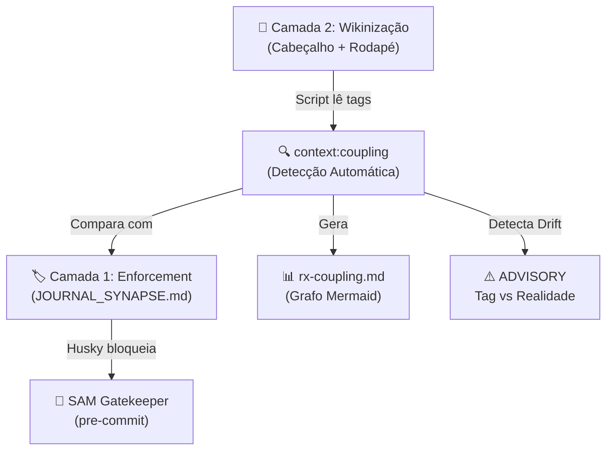

# 🕸️ Coupling Matrix System (Blast Radius Governance)

**Data da Ideia:** 2026-05-04  
**Última Revisão:** 2026-05-04  
**Origem:** Sessão de Hardening (Reflexão sobre as 8 propagações do `spec-driver`)  
**Status:** Nível 1 Implementado ✅ | Níveis 2-3 em Design

---

## 📌 O Problema

Quando um arquivo vital do framework é alterado (ex: `spec-driver.md`), o sistema dependia 100% da memória do Agente ou de "placas de aviso" manuais para lembrar de propagar a mudança para os arquivos correlacionados. Isso falhou na prática: alterar o `spec-driver` exigiu propagações em **8 arquivos** e nenhum mecanismo automatizado detectou a necessidade.

A evidência concreta está no `AGENT_REGISTRY.md`:
> *"Acoplamento Extremo: O @spec-driver não opera isolado. Qualquer alteração nele DEVE ser sincronizada com MASTER_FLOW.md, RULES.md, spec_v3.md..."*

Essa "placa de aviso" é a prova de que o Nível 1 manual já existia e já era insuficiente.

---

## 🏗️ Arquitetura em 3 Camadas



---

## ✅ Nível 1: Enforcement Macro (IMPLEMENTADO)

### O Que É
Regras JSON no `JOURNAL_SYNAPSE.md` que o SAM (`workflow_journal_auditor.py`) valida no `pre-commit` do Husky. Cobrem os "Muros de Arrimo" da governança — os acoplamentos tão críticos que devem ser bloqueantes.

### O Que Já Funciona
| Regra | Gatilho | Exige Propagação Para | Gravidade |
|---|---|---|---|
| `spec_driver_integrity` | `spec-driver.md` muda | `AGENT_REGISTRY`, `RULES`, `MASTER_FLOW` | 🔴 CRITICAL |
| `roles_registry_change` | `AGENT_REGISTRY.md` muda | `FILE_GLOSSARY`, `SCRIPT_GLOSSARY` | 🔴 CRITICAL |
| `sql_change` | `schema.sql` muda | `TECHNICAL_REQUIREMENTS` | 🔴 CRITICAL |
| `new_context_path` | Novo arquivo em `.context/` | `FILE_GLOSSARY` | 🔴 CRITICAL |

### Limitação Deliberada
O Nível 1 **não** lista todas as propagações possíveis. Se colocássemos as 8 dependências do `spec-driver` aqui, um simples typo nele forçaria a abertura e salvamento de 8 arquivos para passar pelo Husky. O Synapse cobre apenas os **eixos fundamentais**. O restante fica para os Níveis 2 e 3.

### Lição Aprendida (Blast Radius Recursivo)
O Synapse pode gerar **cadeia de acoplamento**. Alterar o `spec-driver` dispara a regra `spec_driver_integrity` (exige `AGENT_REGISTRY`), que por sua vez dispara a regra `roles_registry_change` (exige Glossários). Na reforma legislativa, isso forçou a propagação para **9 arquivos** em um único commit.

---

## 📖 Nível 2: Wikinização (EM DESIGN)

### O Que É
Padronizar **todo** arquivo `.md` governamental com um cabeçalho YAML e um rodapé de acoplamento. Cada arquivo passa a "saber" com quem se relaciona, permitindo que um script automatizado leia essas declarações e monte um grafo de dependência visual.

### Template Wiki Padrão

#### Cabeçalho (Frontmatter YAML)
```yaml
---
Titulo: RULES.md
Guardiao: "@context-keeper"
Criado em: 2026-04-24
Ultima Atualizacao: 2026-05-04
Status: Ativo
Affects:
  - brain/MASTER_FLOW.md
  - .agent/subagents/spec-driver.md
Affected-By:
  - brain/INCEPTION.md
  - maintenance/JOURNAL.md
Coupling-Weight: CRITICAL
---
```

#### Rodapé (Tabela de Acoplamento Humano-Legível)
```markdown
---
## 🔗 Mapa de Acoplamento
| Relação | Arquivo | Motivo |
|---------|---------|--------|
| → Affects | `MASTER_FLOW.md` | Define as regras que o fluxo deve cumprir |
| → Affects | `spec-driver.md` | O firmware consome estas regras na execução |
| ← Affected-By | `INCEPTION.md` | Mudanças de escopo geram novas regras |
```

### Direcionalidade (Crítica 3 - Resolvida)
A tag **não** é simétrica. `Affects` e `Affected-By` criam **setas com direção**:
- `Affects`: "Se EU mudar, ESTES devem ser revisados."
- `Affected-By`: "Se ESTES mudarem, EU devo ser revisado."

### Classificação de Acoplamento (Crítica 1 - Resolvida)
Nem toda menção entre arquivos é acoplamento real. O script deve classificar:

| Tipo | Descrição | Peso | Exemplo |
|---|---|---|---|
| `STRUCTURAL` | A define regras que governam B | 🔴 Alto | `RULES.md` → `spec-driver.md` |
| `OPERATIONAL` | A é consumido por script que consome B | 🟠 Alto | `validate_context.py` consome `RULES` + `MASTER_FLOW` |
| `REFERENTIAL` | A cita B como referência de leitura | 🟡 Médio | `JOURNAL.md` → `RULES.md` |
| `NARRATIVE` | A menciona B apenas como contexto | 🟢 Baixo | `rx-learnings.md` → `RULES.md` |

O enforcement deve focar em `STRUCTURAL` e `OPERATIONAL`. Menções `NARRATIVE` são ignoradas.

### Estratégia de Implementação Incremental
**Não wikinizar tudo de uma vez.** O rollout deve ser por camadas de criticidade:

1. **Core Governance (8 arquivos):** `RULES`, `MASTER_FLOW`, `spec-driver`, `AGENT_REGISTRY`, `FILE_GLOSSARY`, `SCRIPT_GLOSSARY`, `INCEPTION`, `JOURNAL_SYNAPSE`
2. **Motores de Automação (7 arquivos):** `validate_context.py`, `harness_runner.py`, `workflow_journal_auditor.py`, etc.
3. **Documentação e RXs (restante):** `rx-communications`, `rx-anatomy`, `rx-biology`, etc.

---

## 🔍 Nível 3: Detecção Automática + Auditor de Drift (EM DESIGN)

### O Que É
Um script Python (`context:coupling`) que:
1. **Varre** todos os arquivos `.md` e lê as tags `Affects`/`Affected-By` do frontmatter.
2. **Gera** o `rx-coupling.md` com um diagrama Mermaid automático e uma tabela de Blast Radius por arquivo.
3. **Audita** a coerência entre as tags declaradas e as menções reais nos arquivos (Coupling Drift).

### O Problema de Bootstrap (Crítica 2 - Resolvida)
Quem garante que as tags `Affects` estão corretas? Ninguém — por isso o script do Nível 3 **não morre** quando as tags existem. Ele se torna um **auditor contínuo** que compara:
- O que a tag YAML diz (Declaração)
- O que a análise de menções reais mostra (Realidade)
- Se houver divergência → `[ADVISORY] Coupling Drift: RULES.md é referenciado por validate_context.py mas não declara esse acoplamento.`

### Saída Esperada: `rx-coupling.md`
```markdown
# 📊 RX-Coupling: Grafo de Dependência Automático
> Gerado por `context:coupling` em 2026-05-XX

## Grafo Visual
(diagrama Mermaid gerado automaticamente)

## Tabela de Blast Radius
| Arquivo | Affects (declarados) | Affected-By (declarados) | Peso |
|---|---|---|---|

## Coupling Drift Detectado
| Arquivo | Tipo de Drift | Detalhe |
|---|---|---|
| `validate_context.py` | Tag ausente | Referencia `RULES.md` mas não declara Affected-By |
```

### Gatilho de Verificação (Crítica 4 - Resolvida)
| Fase | Comportamento | Gatilho |
|---|---|---|
| **Fase 1 (Atual)** | ADVISORY — Avisa mas não bloqueia | `npm run context:coupling` (manual) |
| **Fase 2 (Futuro)** | ADVISORY no pre-commit | Integrado ao `validate_context.py` |
| **Fase 3 (Maduro)** | ERROR — Bloqueia se Drift for CRITICAL | Promoção após confiança nas tags |

---

## 🛡️ Riscos e Mitigações

| Risco | Probabilidade | Impacto | Mitigação |
|---|---|---|---|
| Tags desatualizadas (Coupling Drift) | Alta | Falsa segurança | Camada 3 auditando Camada 2 continuamente |
| Excesso de tags (tudo acoplado a tudo) | Média | Fadiga de alertas | Limitar enforcement a `Coupling-Weight: CRITICAL` |
| Blast Radius Recursivo explosivo | Média | Commit impossível | O Synapse cobre apenas eixos fundamentais |
| Falsos positivos em mudanças cosméticas | Alta | Frustração | Começar como ADVISORY, nunca como FATAL |

---

## 🧭 Nota sobre o TLC `coupling-analysis`

A skill `coupling-analysis` do TLC analisa **código fonte** (imports, dependências entre módulos de software). O nosso problema é sobre **documentos de governança** (`.md`). A heurística é diferente:
- Em código: acoplamento = imports, chamadas de função, tipos compartilhados.
- Em governança: acoplamento = regras que governam comportamento, permissões de escrita, scripts que consomem metadados.

Devemos usar o **conceito** (blast radius, direcionalidade, matriz), mas **não** o script literal.

---

> **"O Nível 1 protege contra a preguiça. O Nível 2 protege contra a ignorância. O Nível 3 protege contra o tempo."** — *Conselho de Arquitetura Antigravity*
