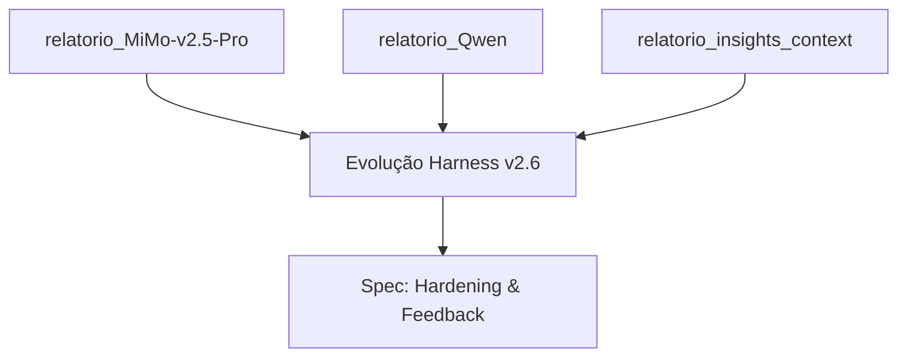

# 📋 Log Cronológico dos Planos (ATIVO)

> **Regra de Ciclo de Vida:** Este arquivo rastreia os documentos de estudo e planejamento **atuais**. Ele deve permanecer na raiz da pasta `planos/` durante todo o processo de análise e implementação. Ao final deste ciclo (após a geração da SPEC e entrega da feature), este log será arquivado na pasta de histórico junto com os relatórios abaixo.

---

| # | Arquivo | Criado em | Autor/Motor | Contexto |
|:---|:---|:---|:---|:---|
| 1 | `relatorio_MiMo-v2.5-Pro.md` | 26/Abr 23:48 | MiMo | **Sugestões para o Harness:** Foco em telemetria, validação incremental via git diff, sistema de severidade (Fatal/Warn) e arquitetura de plugins para o runner. |
| 2 | `relatorio_Qwen.md` | 27/Abr 23:16 | Qwen | **Feedback Determinístico:** Propostas de Auto-Remedy, Budget de Tokens, Drift-Guard e o conceito de Harness como Mentor (LEARNINGS.md). |
| 3 | `relatorio_insights_context.md` | 28/Abr 19:50 | Claude Opus | **Radiografia do .context/:** Análise quantitativa da distribuição de arquivos, paradoxo do peso documental e a proposta do Impact-Aware Harness. |
| 4 | `relatorio_erros_governanca.md` | 30/Abr 00:58 | Flash | **Post-Mortem SAM:** Registro de falhas no Harness (Impact Radius e Handoff) durante o encerramento do Oracle v3. |
| 5 | `comentarios_Flash.md` | 30/Abr 01:04 | Flash | **Proposta H2I:** Design do sistema @harness-sentinel para transformar logs em inteligência evolutiva. |
| 6 | `relatorio_BigPicture_H2I.md` | 30/Abr 01:19 | Flash | **Big Picture:** Consolidação final de todas as visões (MiMo, Qwen, Opus) na arquitetura Sentinela v2.6. |
| 7 | `MiMo_Learnnings.md` | 30/Abr 02:00 | MiMo | **Refinamento de Aprendizados:** Síntese de padrões comportamentais e otimizações de telemetria baseada nos relatórios anteriores. |
| 8 | `MiMo_Learnings_Consolidado.md` | 30/Abr 02:30 | MiMo | **Consolidação Final:** Integração dos aprendizados de sistemas imunológicos e padrões de telemetria para a Spec v2.6. |

---

## 🏗️ Linhagem de Pesquisa (Corrente)

Este set de planos forma a base teórica para a **Evolução do Sistema Imunológico (Harness v2.6+)** do Antigravity Kit.

---
*Instrução: Adicione novos relatórios de estudo nesta tabela conforme forem gerados.*
