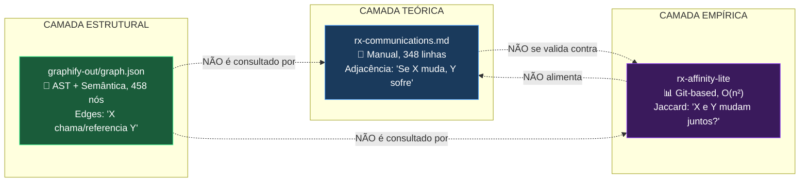
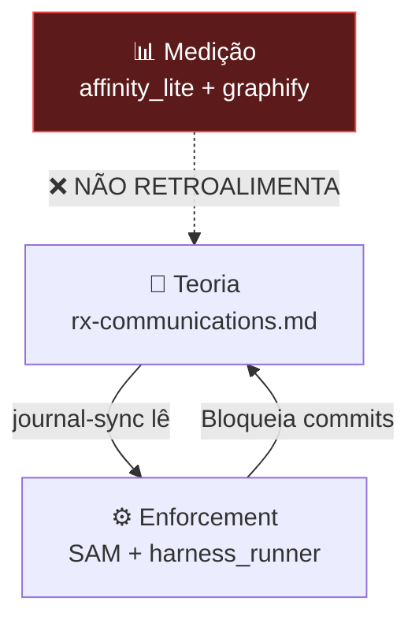
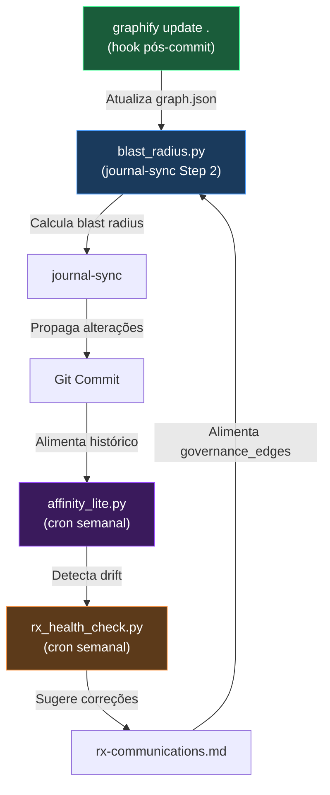
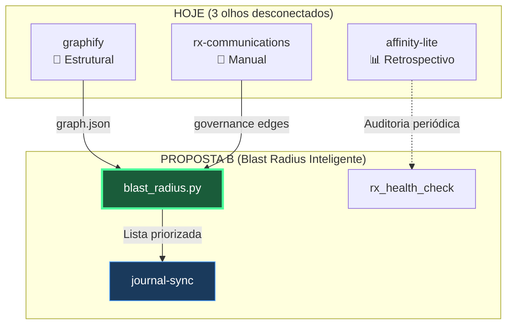

# 🔬 Análise Profunda: Sistema de Propagação H.O.K

> **Escopo:** Avaliação comparativa das 3 camadas de conhecimento sobre dependências (rx-communications, rx-affinity-lite, graphify-out) e proposta de evolução para o sistema de propagação de alterações.

---

## 1. O Estado Atual: Três Olhos que Não se Falam

O seu framework possui hoje **três fontes distintas** de conhecimento sobre como os arquivos se relacionam. Cada uma enxerga a realidade de um ângulo diferente, mas nenhuma alimenta a outra automaticamente.



### 1.1 rx-communications.md — O Mapa Manual

| Aspecto | Avaliação |
|---------|-----------|
| **O que faz** | Mapa de adjacência manualmente mantido. Define "Se altero X, quais Y precisam ser atualizados." |
| **Força** | Extremamente completo (30+ arquivos, 20+ scripts). Usa metáforas biológicas consistentes. Cobertura tanto de documentos quanto de scripts. |
| **Fraqueza crítica** | **Manutenção 100% manual.** Nada garante que está sincronizado com a realidade. Quando você cria um arquivo novo, precisa lembrar de atualizar aqui manualmente. |
| **Quem consome** | O skill `journal-sync` (Step 2: Blast Radius Calculation) lê este arquivo para decidir o que propagar. |

### 1.2 rx-affinity-lite — O Detector Empírico

| Aspecto | Avaliação |
|---------|-----------|
| **O que faz** | Script Python (`affinity_lite.py`) que analisa o `git log` para calcular o coeficiente Jaccard entre pares de arquivos. Detecta "Ghost Couplings" (mudam juntos mas não se referenciam) e "Dead References" (se referenciam mas nunca mudam juntos). |
| **Força** | Data-driven. Revela acoplamentos fantasma que o mapa manual não enxerga. |
| **Fraqueza crítica** | **Gera relatórios que ninguém consome.** O `rx-affinity-lite.json` (108KB, 4728 linhas) é gerado mas nenhum outro script o lê. O comando `npm run context:affinity` **nem existe no package.json** (marcado como "a ser adicionado"). |
| **Quem consome** | Ninguém automaticamente. É lido por humanos/IAs sob demanda. |

### 1.3 graphify-out — O Grafo Estrutural

| Aspecto | Avaliação |
|---------|-----------|
| **O que faz** | Grafo AST+semântico com 458 nós e 549 edges. Tipos de relação: `calls`, `references`, `implements`, `contains`, `defines`, `conceptually_related_to`, `semantically_similar_to`, `rationale_for`. |
| **Força** | **O mais rico dos três.** Mapeia relações no nível de funções e classes, não apenas arquivos. Tem 326 edges cross-file. Atualização sem custo de API (`graphify update .`). Identifica "God Nodes" e "Surprising Connections". |
| **Fraqueza no contexto H.O.K** | Foi construído para navegação por IAs, não para enforcement de governança. Não sabe nada sobre Journal, SAM, ou propagação obrigatória. |
| **Quem consome** | Qualquer IA via regra de roteamento (`graphify.md`). Usado passivamente para responder perguntas sobre arquitetura. |

---

## 2. Diagnóstico: O Gap Central

> **O sistema de propagação tem excelente teoria (rx-communications) e excelente enforcement (SAM/harness), mas o feedback loop entre "o que deveria propagar" e "o que realmente propaga" é quebrado.**



### Problemas Concretos

1. **SAM não lê `rx-communications.md`** — SAM lê `JOURNAL_SYNAPSE.md`. Se uma regra de propagação existe em rx-communications mas não está codificada no Synapse, o SAM é cego a ela.

2. **`rx-affinity-lite.json` é um dead output** — 108KB de dados gerados mas nunca consumidos por nenhum script.

3. **Graphify e Affinity não se conhecem** — O Graphify mapeia relações estruturais (quem chama quem), o Affinity mapeia co-evolução temporal (quem muda junto com quem). Juntos poderiam revelar verdades que nenhum sozinho pode: "A chama B mas eles nunca mudam juntos" = possível bug de propagação.

4. **`rx-communications.md` envelhece silenciosamente** — Quando você criou a skill `journal-sync`, adicionou ela ao rx-communications. Mas quando criou `gov-friction-analyst`? E o próprio Graphify? Cada novo arquivo que não é registrado aqui cria um "ponto cego" de propagação.

---

## 3. Graphify é Overkill?

**Não. É o contrário: é subutilizado.**

O Graphify é a única das 3 ferramentas que opera no nível de **funções e classes**, não apenas de arquivos. Ele sabe que `collect_files()` dentro de `project_bundler.py` chama `classify_domain()`, `chunk_content()`, e `is_sensitive_file()`. Essa granularidade é impossível de replicar manualmente.

> [!IMPORTANT]
> O Graphify não é overkill — é a peça que falta para fechar o loop. Hoje ele serve como GPS passivo. A proposta é transformá-lo em radar ativo.

O que ele **não faz** (e deveria):
- Não calcula "blast radius de governança" (quais docs `.md` precisam ser atualizados quando um `.py` muda)
- Não é consultado pelo `journal-sync` durante a propagação
- Não valida se `rx-communications.md` está completo

---

## 4. Propostas Arquiteturais (Da Mais Cirúrgica à Mais Ambiciosa)

### Proposta A: "Melhora o que existe" — Fortalecer rx-communications com dados dos outros dois

**Esforço:** Baixo | **Impacto:** Médio

Criar um script `rx_health_check.py` que:
1. Lê `rx-communications.md` e extrai todas as edges declaradas
2. Lê `graphify-out/graph.json` e extrai todas as edges cross-file
3. Compara os dois conjuntos
4. Gera relatório: "Edges em rx-communications que o Graphify não encontrou" (possíveis conexões obsoletas) e "Edges no Graphify que rx-communications não declara" (possíveis pontos cegos)

```
Trigger: npm run context:rx-health (ou periodic cron)
Output: .context/monitoring/RX_HEALTH.md
```

> [!TIP]
> **Prós:** Menor mudança no sistema. Reutiliza os dados que já existem. Ataca diretamente o gap "teoria vs realidade".
> **Contras:** Ainda é um relatório passivo — não muda o comportamento do journal-sync.

---

### Proposta B: "Blast Radius Inteligente" — Script que o journal-sync invoca

**Esforço:** Médio | **Impacto:** Alto

Criar um script `blast_radius.py` que:
1. Recebe como input uma lista de arquivos modificados (o "Propagation Seed" do `git status`)
2. Consulta `graphify-out/graph.json` para encontrar todos os nós relacionados (BFS depth=2)
3. Consulta `rx-communications.md` para encontrar o blast radius de governança
4. **Faz a UNIÃO** dos dois conjuntos
5. Retorna uma lista priorizada de arquivos que precisam ser verificados

O skill `journal-sync` seria atualizado para chamar este script no Step 2 (Blast Radius Calculation), **substituindo** a leitura manual do rx-communications.

```python
# Pseudo-código do blast_radius.py
def calculate_blast_radius(changed_files: list[str]) -> dict:
    # 1. Structural blast (Graphify)
    graph = load_graph("graphify-out/graph.json")
    structural = bfs_neighbors(graph, changed_files, depth=2)
    
    # 2. Governance blast (rx-communications)
    governance = parse_adjacency("rx-communications.md", changed_files)
    
    # 3. Union + dedup + classify
    return {
        "must_update": governance & structural,  # Ambas concordam
        "likely_update": structural - governance,  # Graphify encontrou, rx não declara
        "declared_only": governance - structural,  # rx declara, Graphify não vê
    }
```

**Atualização no journal-sync (Step 2):**
```diff
 ### Step 2: Blast Radius Calculation
-1. Use `view_file` to read `.context/maintenance/rx-communications.md`.
-2. Use the "Propagation Seed" as search keys in Section 4 and 5.
+1. Run `python .context/_scripts/blast_radius.py` with the Propagation Seed.
+2. The script returns three categories: must_update, likely_update, declared_only.
 3. Identify all files listed under "Afeta:" for those modified files.
 4. **Raciocínio Recursivo (OBRIGATÓRIO):** ...
```

> [!TIP]
> **Prós:** O journal-sync ganha inteligência estrutural sem que a IA precise ler 348 linhas de rx-communications manualmente. A IA recebe uma lista priorizada e foca seu raciocínio recursivo nos casos ambíguos (`likely_update` e `declared_only`).
> **Contras:** Requer que o Graphify esteja sempre atualizado (mas `graphify update .` é gratuito e pode ser hook).

---

### Proposta C: "Aposentar rx-communications" — Graphify como SSOT de Propagação

**Esforço:** Alto | **Impacto:** Muito Alto

Substituir completamente o mapa manual `rx-communications.md` pelo `graph.json` + anotações de governança.

**Como funcionaria:**
1. O `graph.json` já mapeia relações estruturais (calls, references, implements)
2. Adicionar um arquivo `governance_edges.json` que declara as **regras de propagação não-estruturais** (ex: "mudou RULES.md → atualizar MASTER_FLOW.md" — essa relação é de governança, não de código)
3. O `blast_radius.py` faz a união dos dois
4. `rx-communications.md` vira apenas documentação narrativa (não mais SSOT)

> [!WARNING]
> **Prós:** Elimina a manutenção manual do mapa de propagação. As relações estruturais se atualizam sozinhas com `graphify update`.
> **Contras:** Relações de governança (ex: JOURNAL → LEARNINGS) não são detectáveis por AST. Precisam ser declaradas manualmente em `governance_edges.json`. Risco de perder a riqueza narrativa do rx-communications.

---

### Proposta D: "The Loop" — Feedback Contínuo Automático

**Esforço:** Muito Alto | **Impacto:** Transformacional

Integrar as 3 fontes em um ciclo fechado que se autocorrige:



> [!CAUTION]
> Esta proposta é a mais poderosa mas tem altíssimo custo de implementação. Recomendo como objetivo de longo prazo, não como próximo passo.

---

## 5. Recomendação

> [!IMPORTANT]  
> ### Implementar Proposta B (Blast Radius Inteligente) com elementos da Proposta A

> Detalhamento operacional (auditoria + mini-spec):
> `planos/mudanca_propagacao/propagation_analysis_mini_spec.md`

**Justificativa:**
- A Proposta B resolve o problema central (journal-sync cego) com esforço moderado
- A Proposta A (rx_health_check) pode ser feita como bônus para validar o rx-communications
- As Propostas C e D são evoluções naturais que podem vir depois, sem conflito

**Plano concreto em 4 passos:**

| # | O que | Arquivo | Esforço |
|---|-------|---------|---------|
| 1 | Criar `blast_radius.py` que lê `graph.json` + `rx-communications.md` e retorna blast radius priorizado | `.context/_scripts/blast_radius.py` | ~150 linhas |
| 2 | Atualizar `journal-sync/SKILL.md` Step 2 para chamar `blast_radius.py` em vez de ler rx-communications manualmente | `.agent/skills/journal-sync/SKILL.md` | ~10 linhas |
| 3 | Adicionar `graphify update .` no hook `pre-commit` (zero custo, AST only) | `.husky/pre-commit` | ~1 linha |
| 4 | Registrar no `SCRIPT_GLOSSARY.md` e `rx-communications.md` | Docs | ~20 linhas |

**Resultado esperado:** Quando a IA fizer `journal-sync`, em vez de ler 348 linhas de rx-communications e raciocinar sobre cada edge manualmente, ela receberá uma lista priorizada e focada:

```
must_update:    [SCRIPT_GLOSSARY.md, HARNESS_LOG.md]
likely_update:  [rx-anatomy.md]  ← Graphify encontrou mas rx não declara
declared_only:  []               ← rx declara mas Graphify não vê
```

A IA então aplica o Raciocínio Recursivo apenas nos 3 arquivos relevantes, não nos 30+ listados no mapa inteiro.

---

## 6. Sobre o `rx-affinity-lite` — O que fazer com ele?

O affinity detector é útil mas **não é urgente** para o sistema de propagação. Ele responde uma pergunta diferente: "Estamos honrando as relações declaradas na prática?"

**Recomendação:** Manter como ferramenta de auditoria periódica. Corrigir os bugs (excluir `.pyc`, adicionar o `npm run context:affinity` no `package.json`), e eventualmente integrá-lo no `rx_health_check.py` da Proposta A como validação cruzada.

Não o incorpore ao fluxo ativo de propagação — ele é lento (O(n²)) e seus dados são retrospectivos, não preditivos.

---

## 7. Resumo Visual


