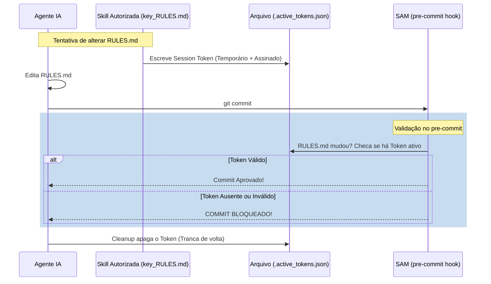

# 🏛️ Propostas de Evolução de Governança: H.O.K Forge

Este documento consolida as ideias discutidas para blindagem e otimização comportamental das IAs no repositório. O objetivo é evitar "attention drift" (desvio de atenção) e modificações acidentais ou maliciosas em arquivos críticos, sem criar atrito (friction bloat) desnecessário no desenvolvimento diário.

---

## 💡 Ideia 1: Padrão de Arquivo Auto-Vacinado (Self-Vaccinated Files)

### O Problema
Regras globais no prompt de boot (como `AGENTS.md`) tendem a ser esquecidas ou ignoradas pela IA no meio de execuções táticas complexas (context dilution).

### A Solução
Injetar metadados e regras de uso **diretamente no topo** de cada arquivo `.md` estratégico (como `RULES.md`, `FILE_GLOSSARY.md`, etc.). Como a ferramenta `view_file` lê sequencialmente da linha 1 em diante, a IA é forçada a carregar as regras de uso no seu contexto ativo antes de ler ou alterar o arquivo.

```markdown
---
status: Ativo
escopo: "Descrever o Roteamento de Atos e Leis Macro do repositório."
regras_de_ouro:
  - "NUNCA adicione detalhes de execução da spec aqui."
  - "Modificações neste arquivo exigem sincronia no FILE_GLOSSARY.md."
---
```

> [!TIP]
> **Automação (Harness/SAM):** O validador do pre-commit (`validate_context.py`) pode rejeitar commits se qualquer arquivo `.md` estratégico tiver o cabeçalho YAML removido ou desconfigurado.

---

## 🔒 Ideia 2: Cadeado Criptográfico de Skill (Skill Token Lock)

### O Problema
Qualquer conversa livre de chat pode usar o comando `write_file` nativo e alterar arquivos de regras fundamentais (como `RULES.md` ou `AGENT_REGISTRY.md`) sem seguir o fluxo correto de discussão arquitetural ou decisão.

### A Solução
Implementar uma trava física de commit. Arquivos críticos do **Córtex** só podem ser modificados e commitados se a transação estiver "assinada" por um token de sessão gerado por uma skill específica (ex: `key_RULES.md`).



### Escopo de Proteção Recomendado (O Córtex)
Para evitar lentidão (friction-bloat) no código, a trava deve focar apenas no núcleo:
- `RULES.md` (Constituição)
- `MASTER_FLOW.md` (Processos)
- `AGENT_REGISTRY.md` (Permissões de Personas)
- `FILE_GLOSSARY.md` (Dicionário de Estrutura)

---

## 🧲 Ideia 3: Magnetismo de Pasta de Spec (Local Spec Rules)

### O Problema
Features específicas frequentemente necessitam de regras de negócio ou de arquitetura exclusivas temporárias. Se colocarmos todas as regras específicas no `RULES.md` global, geramos poluição de tokens e burocracia permanente.

### A Solução
Permitir a criação de um `AGENTS.md` **local** dentro da pasta efêmera da spec (`.specs/features/minha_feature/AGENTS.md`).

```text
.specs/features/minha_feature/
├── spec.md              # Requisitos (O que fazer)
├── STATE.md             # Status
└── AGENTS.md            # Regras Locais (Como fazer especificamente aqui)
```

### O Mecanismo de Atração (Orquestrado)
O magnetismo é gerado pelo Orquestrador pai (`sdd-orchestrator`):
1. Antes de invocar o subagente executor (`@spec-driver`), o orquestrador verifica a existência do `AGENTS.md` local.
2. Se existir, o orquestrador **injeta** dinamicamente no prompt de inicialização do subagente a obrigação de ler e obedecer às regras do arquivo local.
3. Após o merge, essas regras locais morrem com o expurgo da pasta da Spec, mantendo o repositório principal 100% limpo.

---

## 📅 Próximos Passos
- [ ] Implementar a validação de cabeçalhos YAML (Ideia 1) no `validate_context.py`.
- [ ] Criar o protótipo do script `auth_gate.py` para gerenciamento de tokens de sessão (Ideia 2).
- [ ] Atualizar a Skill `sdd-orchestrator` para suportar o magnetismo de regras de spec locais (Ideia 3).
